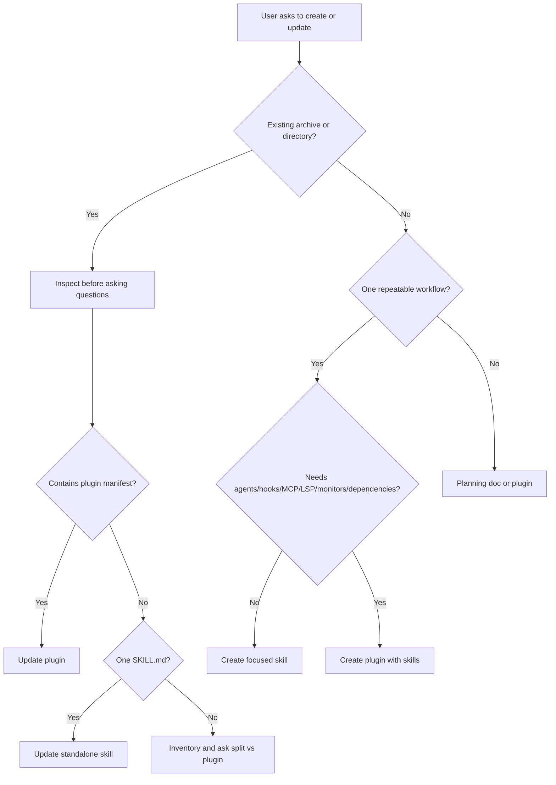

# Claude extension decision tree

Use this file to decide whether to create a skill, plugin, planning document, or update.

## Decision flow

## Choose a skill when

- One workflow can be described in a compact `SKILL.md`.
- The user needs repeatable prompts, templates, references, or deterministic scripts.
- There is no need for plugin-level installation, multiple component types, or dependencies.

## Choose a plugin when

- Multiple skills should ship together.
- The workflow needs plugin agents, hooks, MCP servers, LSP servers, monitors, channels, settings, commands, or dependencies.
- The user wants an installable extension bundle.
- The workflow is an operating model rather than a single task.

## Choose planning only when

- The user asks for an architecture or roadmap.
- The required external systems are not available yet.
- The user needs approval before implementation.

## Ask a clarification only when

The missing answer changes the artefact structure, permissions, target environment, or output contract. Otherwise, proceed with stated assumptions.
