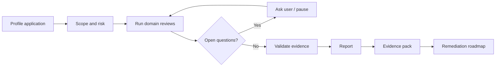

# Software assurance plugin patterns

Use this reference when creating or updating skills/plugins for audits, reviews, compliance readiness, security, reliability, performance, privacy, or SDLC assurance.

## Profile-first pattern

Start with a profile that captures:

- languages, frameworks, package managers, runtimes;
- architecture, entrypoints, services, APIs, queues, integrations;
- data stores, PII categories, retention and deletion signals;
- authentication and authorisation model;
- CI/CD, deployment, infrastructure, cloud, IaC;
- tests, scanners, observability, incidents, backups;
- compliance applicability signals;
- connected MCPs/LSPs and unavailable evidence.

## Domain agents

Recommended agents:

- orchestrator;
- application profiler;
- security auditor;
- performance/scalability auditor;
- reliability/SRE auditor;
- cloud/infrastructure auditor;
- SDLC/CI/CD auditor;
- supply-chain auditor;
- privacy/data auditor;
- compliance controls auditor;
- evidence curator;
- validator;
- report synthesiser.

## Finding contract

Every finding should include:

```yaml
id: SAAP-001
domain: security|performance|reliability|privacy|compliance|sdlc|supply-chain|quality|infrastructure
severity: CRITICAL|HIGH|MEDIUM|LOW|INFO
confidence: high|medium|low
title: short title
summary: concise evidence-backed explanation
evidence:
  - type: file|command|mcp|scanner|policy|user-input
    ref: path:line or resource id
impact: what can go wrong
recommendation: what to do
verification: how to prove the fix
control_mappings: []
```

## Assurance workflow



## Compliance language

Use precise wording:

- "readiness assessment" or "gap review" for informal/commercial reviews;
- "SOC 2 examination" only for qualified service-auditor work;
- "control mapping" rather than "certification" unless a formal certification body is involved;
- "not legal advice" for regulatory applicability triage.

## Cross-stack rule

Branch on detected capabilities rather than hard-coded stack names. Example: audit any `auth_layer`, not only `NextAuth`; audit any `data_store`, not only `Postgres`; audit any `ci_provider`, not only GitHub Actions.
