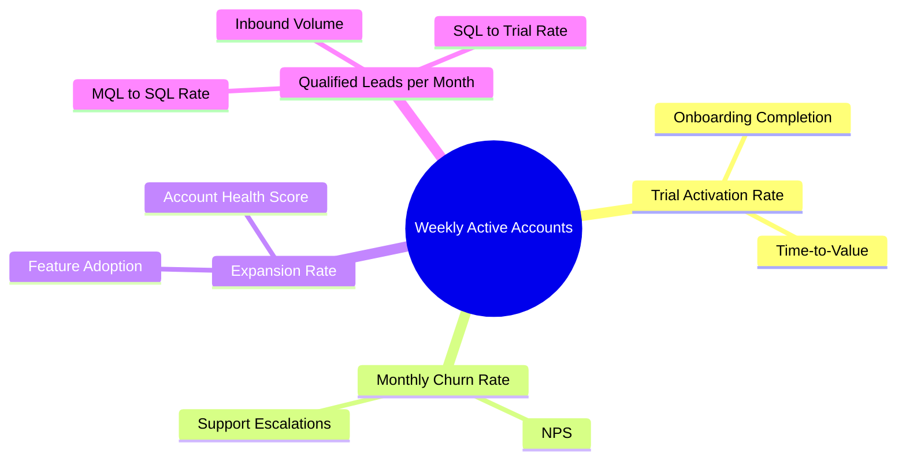

# KPI Framework — Groundwork HR

**Date:** 15/05/2026
**Business Model:** SaaS — HR compliance software for Australian SMBs (50–200 employees)
**Reporting Cadence:** Monthly (leadership); Weekly (sales and ops)
**Framework prepared by:** KPI Framework Generator skill

---

## North-Star Metric

| Field | Value |
|-------|-------|
| **Metric name** | Weekly Active Accounts (WAA) |
| **Definition** | Accounts with at least one meaningful action (policy update, compliance check, or employee record change) in the last 7 days |
| **Formula** | COUNT(accounts where last_active_date ≥ today − 7 days) |
| **Current value** | 312 |
| **Target** | 480 by 31/12/2026 |
| **Data source** | Product analytics (Mixpanel) |
| **Why this metric** | HR software delivers value when HR managers actually use it. WAA captures real engagement, not just logins. Accounts with WAA > 3 weeks/month churn at 0.3% vs 4.2% for inactive accounts — it's the strongest predictor of retention. |

---

## Input Metrics

| # | Metric | Definition | Causal Link to North-Star | Current | Target | Owner | Cadence |
|---|--------|-----------|--------------------------|---------|--------|-------|---------|
| 1 | Trial activation rate | % of trial accounts completing onboarding checklist (5 tasks) within 14 days | Activated trials → paying accounts → WAA base grows | 34% | 55% | Head of Product | Monthly |
| 2 | Monthly churn rate | % of paying accounts cancelled in the month | Every churned account shrinks WAA; 1% churn × 12 = ~12% annual base erosion | 1.8% | < 1.0% | Head of CX | Monthly |
| 3 | Expansion rate | % of accounts upgrading to a higher tier in the month | Expanded accounts use more features → higher WAA; expansion MRR funds growth | 2.1% | 4.0% | Account Management Lead | Monthly |
| 4 | Qualified leads per month | Inbound + outbound leads meeting ICP criteria (50–200 employees, AU-based) | New qualified leads → trials → active accounts 30–60 days later | 68 | 110 | Head of Marketing | Weekly |

---

## KPI Tree

```
Weekly Active Accounts (North-Star)
├── Trial activation rate
│   ├── Onboarding completion rate (Product)
│   └── Time-to-value — days to first compliance check (Product)
├── Monthly churn rate
│   ├── NPS — monthly survey (CX)
│   └── Escalated support tickets / month (CX)
├── Expansion rate
│   ├── Feature adoption rate — advanced modules (Product)
│   └── Account health score (CX)
└── Qualified leads per month
    ├── MQL → SQL conversion rate (Marketing → Sales)
    ├── Inbound lead volume (Marketing)
    └── SQL → trial conversion (Sales)
```

---

## KPI Framework Mindmap



---

## KPI Cards — Full Reference

### Sales KPIs

| KPI | Definition | Formula | Owner | Baseline | Target | Cadence | Data Source |
|-----|-----------|---------|-------|---------|--------|---------|------------|
| SQL → Trial conversion | % of sales-qualified leads who start a trial | Trials started / SQLs × 100 | Head of Sales | 52% | 65% | Weekly | HubSpot CRM |
| Win rate (trial → paid) | % of trials that convert to a paid plan | Paid conversions / trials closed × 100 | Head of Sales | 28% | 40% | Monthly | HubSpot CRM |
| Average contract value (ACV) | Average annual revenue per new account | Total new ARR / new accounts | Head of Sales | $3,840 | $4,800 | Monthly | Xero |
| Sales cycle length | Average days from first contact to paid | Mean(paid date − first contact date) | Head of Sales | 24 days | 18 days | Monthly | HubSpot CRM |

### Marketing KPIs

| KPI | Definition | Formula | Owner | Baseline | Target | Cadence | Data Source |
|-----|-----------|---------|-------|---------|--------|---------|------------|
| Inbound lead volume | MQLs generated from inbound channels | COUNT(inbound MQLs) | Head of Marketing | 42/month | 75/month | Weekly | HubSpot |
| CAC | Total marketing + sales spend / new customers | (Marketing spend + Sales cost) / new customers | Head of Marketing | $1,240 | < $900 | Monthly | Xero + HubSpot |
| MQL → SQL conversion | % of marketing leads accepted by sales | SQLs / MQLs × 100 | Head of Marketing | 38% | 50% | Monthly | HubSpot |
| Content-attributed leads | Leads from organic search + content assets | COUNT(leads with source = organic/content) | Marketing Manager | 18/month | 35/month | Monthly | GA4 + HubSpot |

### Operations KPIs

| KPI | Definition | Formula | Owner | Baseline | Target | Cadence | Data Source |
|-----|-----------|---------|-------|---------|--------|---------|------------|
| Onboarding completion rate | % of new accounts completing all 5 onboarding tasks | Accounts with 5/5 tasks / new accounts × 100 | Head of Ops | 34% | 55% | Monthly | Mixpanel |
| Support ticket resolution time | Average hours from ticket open to resolved | Mean(resolved_at − opened_at) | Ops Manager | 11.2 hrs | < 6 hrs | Weekly | Intercom |
| SLA compliance rate | % of tickets resolved within SLA (4 hrs critical, 24 hrs standard) | Within-SLA resolutions / total × 100 | Ops Manager | 71% | 92% | Weekly | Intercom |

### Product KPIs

| KPI | Definition | Formula | Owner | Baseline | Target | Cadence | Data Source |
|-----|-----------|---------|-------|---------|--------|---------|------------|
| Time-to-value | Average days from trial start to first compliance check | Mean(first_compliance_check − trial_start) | Head of Product | 8.4 days | ≤ 4 days | Monthly | Mixpanel |
| Advanced module adoption | % of paid accounts using at least one advanced module (e.g. incident tracker) | Accounts with advanced event / paid accounts × 100 | Head of Product | 21% | 40% | Monthly | Mixpanel |
| Feature release cadence | Meaningful feature releases per month | COUNT(production deployments with feature flag) | Engineering Lead | 2.1/month | 3/month | Monthly | GitHub |

### Finance KPIs

| KPI | Definition | Formula | Owner | Baseline | Target | Cadence | Data Source |
|-----|-----------|---------|-------|---------|--------|---------|------------|
| Gross margin | (Revenue − COGS) / Revenue × 100 | (MRR − hosting + support costs) / MRR | CFO | 71% | 78% | Monthly | Xero |
| MRR | Monthly recurring revenue | SUM(active subscriptions × monthly rate) | CFO | $148,200 | $225,000 by Dec | Monthly | Xero / Stripe |
| CAC payback period | Months to recover CAC from gross margin | CAC / (ARPU × gross margin %) | CFO | 14.2 months | < 12 months | Monthly | Xero |
| Operating expense ratio | Total opex / revenue | Total opex / MRR × 100 | CFO | 84% | < 70% | Monthly | Xero |

### Customer Experience KPIs

| KPI | Definition | Formula | Owner | Baseline | Target | Cadence | Data Source |
|-----|-----------|---------|-------|---------|--------|---------|------------|
| NPS | Net Promoter Score | % Promoters − % Detractors | Head of CX | +22 | +45 | Monthly | Delighted |
| Monthly churn rate | % accounts churned per month | Churned accounts / start-of-month accounts × 100 | Head of CX | 1.8% | < 1.0% | Monthly | Stripe |
| Expansion MRR % | Expansion MRR as % of beginning MRR | Expansion MRR / beginning MRR × 100 | Account Management Lead | 2.1% | 4.0% | Monthly | Stripe |

---

## OKR Alignment

| Objective | Key Result | Primary KPI | Owner | Target |
|-----------|-----------|-------------|-------|--------|
| Achieve product-market fit with AU mid-market HR teams | Net Revenue Retention ≥ 110% by 31/12/2026 | Monthly churn rate | Head of CX | < 1.0% |
| Achieve product-market fit with AU mid-market HR teams | NPS ≥ 45 by 31/12/2026 | NPS | Head of CX | +45 |
| Build a repeatable growth engine | Qualified leads ≥ 110/month by Q3 | Inbound lead volume | Head of Marketing | 75/month (Q2) → 110/month (Q3) |
| Build a repeatable growth engine | CAC payback < 12 months by 31/12/2026 | CAC payback period | CFO | < 12 months |
| Scale to $2.7M ARR by end of 2026 | MRR ≥ $225,000 by 31/12/2026 | MRR | CFO | $225,000 |

---

## KPI Health Dashboard Template

| KPI | Current | Target | Status | Owner | Notes |
|-----|---------|--------|--------|-------|-------|
| Weekly Active Accounts | 312 | 480 | At Risk | Head of Product | Activation rate is bottleneck |
| Trial activation rate | 34% | 55% | Off Track | Head of Product | Onboarding redesign in progress |
| Monthly churn rate | 1.8% | < 1.0% | At Risk | Head of CX | 3 accounts at-risk flagged |
| MRR | $148,200 | $225,000 | On Track | CFO | On pace for Q2 target |
| Inbound leads | 42/month | 75/month | At Risk | Head of Marketing | SEO campaign launching Wk 3 |
| NPS | +22 | +45 | Off Track | Head of CX | Post-onboarding survey response low |

---

## Build-to List

| KPI | What's Needed | Recommended Tool | Effort | Priority |
|-----|--------------|-----------------|--------|---------|
| Feature adoption rate | Event tracking for module-level usage | Mixpanel (already in use — add events) | 3 days (engineering) | High |
| Account health score | Composite score model (logins + events + support tickets) | Build in Mixpanel or HubSpot custom property | 1 week | Medium |
| Content-attributed leads | UTM tracking + HubSpot source attribution | GA4 + HubSpot (already in use — fix UTM policy) | 1 day (ops) | High |

---

## Next 30-Day Actions

1. Engineering to add module-level Mixpanel events by 30/05/2026 — unblocks feature adoption KPI.
2. Marketing to enforce UTM naming convention on all campaigns by 23/05/2026 — fixes content attribution gap.
3. Head of CX to schedule monthly NPS survey via Delighted and set up automated trigger at 60-day account mark by 27/05/2026.
