# Operational Bottleneck Analysis — Groundwork HR

**Date:** 15/05/2026
**Process domain:** Customer onboarding
**Data source:** Both (Mixpanel export + team interviews)
**Analysis prepared by:** Operational Bottleneck Detector skill

---

## Executive Summary

- The primary bottleneck is the **IT provisioning step** in onboarding: average cycle time of 6.4 days against a 1-day SLA, with 34 items in WIP — Little's Law confirms this stage is running at 3.2× sustainable load.
- Throughput loss across the onboarding process is estimated at **38%**: only 21 accounts complete onboarding per month against a theoretical capacity of 34 given current inbound volume.
- The root cause is a **systems constraint** — IT provisioning relies on a manual Slack-to-Jira workflow with no SLA automation; exploiting this with a Zapier integration is estimated to reduce CT from 6.4 to 1.2 days with 3 days of engineering effort.

---

## Process Map

| Stage | Input | Output | Role / System | CT (avg) | WIP | SLA | Value-Added? |
|-------|-------|--------|--------------|---------|-----|-----|-------------|
| Contract signed | Stripe webhook | Account created | Automated (Stripe + HubSpot) | 0.1 hrs | 2 | Auto | Yes |
| Welcome email + login | Account created | Login sent | Automated (Intercom) | 0.5 hrs | 3 | 2 hrs | Yes |
| IT provisioning | Login sent | Permissions configured | IT Administrator (manual) | 6.4 days | 34 | 1 day | Yes — but severely delayed |
| Onboarding call scheduled | Permissions confirmed | Calendar invite sent | Customer Success Rep | 1.2 days | 8 | 2 days | Yes |
| Onboarding call completed | Call scheduled | 5-task checklist opened | Customer Success Rep | 0.5 hrs | 6 | N/A | Yes |
| Checklist completion | Call completed | Account activated | Customer (self-serve) | 8.3 days | 22 | 14 days | Yes |

**Total lead time:** 18.8 days average
**Value-added time:** 4.3 days
**Process efficiency:** 22.9% (77.1% of elapsed time is waiting or queued)

---

## Value-Stream Map

```mermaid
flowchart LR
  Input([Contract Signed])

  subgraph S1["Contract + Welcome Email"]
    direction TB
    S1CT["CT: 0.6 hrs"]
    S1WIP["WIP: 5"]
  end

  subgraph S2["IT Provisioning ⚠️ BOTTLENECK"]
    direction TB
    S2CT["CT: 6.4 days"]
    S2WIP["WIP: 34 — CRITICAL"]
  end

  subgraph S3["Onboarding Call"]
    direction TB
    S3CT["CT: 1.7 days"]
    S3WIP["WIP: 14"]
  end

  subgraph S4["Checklist Completion"]
    direction TB
    S4CT["CT: 8.3 days"]
    S4WIP["WIP: 22"]
  end

  Input --> S1
  S1 -->|"Wait: ~0"| S2
  S2 -->|"Wait: 1.2 days"| S3
  S3 -->|"Wait: ~0"| S4
  S4 --> Output([Account Activated])
```

---

## Throughput Analysis

| Stage | Mean CT | Median CT | P90 CT | Avg WIP | Throughput/day | Little's Law WIP | Consistent? |
|-------|---------|----------|--------|---------|---------------|-----------------|------------|
| Contract + welcome | 0.6 hrs | 0.5 hrs | 1.2 hrs | 5 | 8.4/day | 0.2 | No — WIP higher than expected ⚠️ |
| IT provisioning | 6.4 days | 5.1 days | 14.2 days | 34 | 1.05/day | 6.7 | No — WIP 5× Little's Law ⚠️ |
| Onboarding call | 1.7 days | 1.4 days | 3.8 days | 14 | 1.05/day | 1.8 | Marginal ⚠️ |
| Checklist completion | 8.3 days | 7.1 days | 19.4 days | 22 | 0.78/day | 10.6 | No — WIP higher than expected |

**Overall throughput loss:** 38% (13 accounts per month below theoretical capacity of 34)

---

## Bottleneck Register

| # | Location | Root-Cause Category | Severity (1–5) | Evidence | Throughput Loss | Fix Type |
|---|---------|-------------------|---------------|---------|----------------|---------|
| 1 | IT provisioning | Systems | 5 | Data (Mixpanel) + Interview | 38% of total | Quick win + System |
| 2 | Checklist completion | Process | 3 | Data (Mixpanel) | Secondary — 15% potential loss | Process change |

### Bottleneck 1: IT Provisioning

**Root-cause chain (5 Whys):**
1. Why is IT provisioning taking 6.4 days on average? → Tickets are created manually in Jira by the IT admin after seeing a Slack message.
2. Why is the Slack message approach used? → There is no automated trigger from Stripe/HubSpot to create a Jira ticket.
3. Why was no automation built? → When the process was designed (2023), volume was < 5 accounts/month. Manual was "good enough."
4. Why hasn't this been fixed since volume grew? → The IT admin raised it in Q3 2025, but it was deprioritised against product work.
5. **Root cause:** No automated provisioning trigger. A single IT admin processes all requests manually at growing volume, with no SLA enforcement or queue visibility.

### Bottleneck 2: Checklist Completion

**Root-cause chain (5 Whys):**
1. Why do accounts take 8.3 days to complete the 5-task checklist? → No reminder emails are sent after the onboarding call; customers forget.
2. Why are no reminders sent? → The Intercom sequence is not configured to trigger post-call.
3. **Root cause:** Missing automated follow-up sequence in Intercom. Accounts are left to self-serve with no nudge.

---

## Remediation Queue

| Priority | Stage | Fix | Type | Expected Uplift | Effort | Owner | Start |
|---------|-------|-----|------|----------------|--------|-------|-------|
| P1 | IT provisioning | Build Zapier automation: Stripe "customer.created" → HubSpot task → Jira ticket with SLA label. Add Slack alert to IT admin if ticket > 4 hrs old. | System (quick win) | 38% throughput uplift; CT target ≤ 1.2 days | Low (3 days engineering) | Head of Engineering | 19/05/2026 |
| P2 | Checklist completion | Configure Intercom post-call sequence: Day 1, Day 4, Day 8 reminder emails with direct checklist link. Add in-app nudge for incomplete tasks. | Process change | 15% throughput uplift; CT target ≤ 5 days | Low (1 day ops) | Head of CX | 22/05/2026 |
| P3 | IT provisioning (structural) | Implement self-service provisioning via SCIM/SSO integration for accounts using Google Workspace or Microsoft 365 (covers ~60% of customer base). | System investment (1–2 months) | Removes constraint permanently | High | Head of Product | Q3 2026 |

---

## Constraint Cascade Warning

Once the primary constraint (IT provisioning) is resolved, the next binding constraint is likely to be **the onboarding call scheduling step** (currently at 14 WIP with 1.7 days average cycle time — sustainable today but will receive 38% more throughput once provisioning is fixed). Monitor this stage immediately: if WIP > 20 within 14 days of the P1 fix going live, Customer Success needs an additional rep or an async onboarding alternative.

---

## Recommended KPIs to Track Post-Fix

1. **IT provisioning cycle time** — target ≤ 1.2 days; review weekly in Jira
2. **Onboarding call WIP** — early warning for cascade constraint; alert at > 20 items
3. **Trial activation rate (onboarding completion %)** — tracks overall process health; target 55% within 14 days (current 34%)
