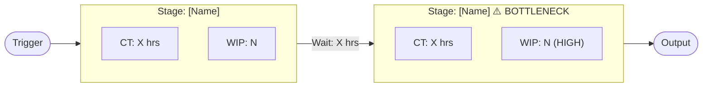

# Operational Bottleneck Detector — Reference Material

## Theory of Constraints (Goldratt) — 5 Focusing Steps

The Theory of Constraints (TOC) holds that every system has exactly one binding constraint at any time. To improve throughput, identify and address that constraint before doing anything else.

### The 5 Focusing Steps

1. **Identify** — Find the one constraint that limits the system's throughput. Look for: highest WIP, longest wait time, highest variance, most re-work.

2. **Exploit** — Get maximum output from the constraint with current resources. Common tactics:
   - Eliminate non-value-added work at the constraint stage
   - Ensure the constraint is never starved (buffer before it)
   - Move work to other resources where possible
   - Reduce batch sizes to decrease wait time

3. **Subordinate** — Adjust everything else to support the constraint. Upstream stages should feed the constraint at its pace, no faster. Over-production upstream only builds queue.

4. **Elevate** — If exploitation is not enough, invest to increase the constraint's capacity (hire, automate, redesign).

5. **Repeat** — Once the constraint is resolved, the next weakest link becomes the new constraint. The process repeats.

### TOC Key Terms

| Term | Definition |
|------|-----------|
| Constraint (bottleneck) | The stage that limits overall system throughput |
| Buffer | Inventory or capacity held immediately before a constraint to prevent starvation |
| Throughput | Rate at which the system generates output (revenue, completions) |
| Operating expense | Money spent turning inventory into throughput |
| Inventory / WIP | Work in process — items between stages |
| Exploitation | Maximising output from constraint with existing resources |
| Elevation | Adding capacity to the constraint |

---

## Value Stream Mapping (VSM)

VSM is a lean tool for visualising the entire flow of a process from trigger to output, including both value-added and non-value-added time.

### VSM Key Metrics

| Metric | Definition | Formula |
|--------|-----------|---------|
| Cycle time (CT) | Time to complete one unit at a stage | End time − start time |
| Lead time (LT) | Total elapsed time from start to finish | Sum of all stage cycle times + wait times |
| Value-added time (VAT) | Time actually working on the unit | Sum of work time only (no waiting) |
| Process efficiency | % of lead time that is value-added | VAT / LT × 100% |
| WIP | Work in process at a stage | Items started but not completed |
| Throughput (TH) | Output per time unit | Completions / time period |

### VSM Mermaid Template

---

## Little's Law

**WIP = Throughput × Cycle Time**

Or equivalently:
- Cycle Time = WIP / Throughput
- Throughput = WIP / Cycle Time

### Application

If you know any two of the three values, you can derive the third. Use this to:
1. **Validate** user-provided data: if WIP = 50, throughput = 10/week, then CT must = 5 weeks. If the user says CT = 2 weeks, the data is inconsistent.
2. **Model interventions**: to halve cycle time without adding capacity, you must halve WIP (WIP limits).
3. **Size buffers**: to maintain throughput when adding a constraint buffer, calculate how much WIP the buffer needs.

### WIP Limit Heuristic

Optimal WIP for a stage ≈ Throughput × Target Cycle Time

If WIP > 2× this value, the stage is likely a bottleneck or is being over-fed by upstream.

---

## Bottleneck Severity Scoring Rubric

| Severity | Description | Operational Impact |
|----------|-------------|-------------------|
| 1 — Minor | Occasional delays, self-corrects | < 5% throughput loss |
| 2 — Moderate | Consistent queue, SLA occasionally missed | 5–15% throughput loss |
| 3 — Significant | Regular SLA misses, customer complaints | 15–30% throughput loss |
| 4 — Major | Blocking revenue or delivery; escalations | 30–50% throughput loss |
| 5 — Critical | System effectively stopped at this stage | > 50% throughput loss or total blockage |

---

## Root-Cause Categories

| Category | Common Causes | Typical Fix |
|----------|--------------|-------------|
| **People** | Skill gap, capacity overload, unclear ownership, single point of failure | Training, hiring, cross-training, role clarity |
| **Process** | Missing SOP, approval loops, re-work triggers, batch processing | SOP documentation, approval redesign, error-proofing |
| **Systems** | Manual workaround, integration gap, tooling limitation, data entry duplication | Automation, API integration, system upgrade |
| **Supply** | Supplier lead time, external approval, dependency on a third party | Dual-sourcing, SLA renegotiation, buffer stock |

---

## Effort/Impact Prioritisation

Prioritisation score = (Severity × Expected Uplift %) / Effort Score

**Effort scores:**
- Quick win (< 1 week): 1
- Process change (1–4 weeks): 2
- System investment (1–3 months): 4
- Structural change (3+ months): 8

**Expected uplift:** estimated % throughput improvement if constraint is resolved.

| Score | Priority |
|-------|---------|
| > 20 | P1 — Fix immediately |
| 10–20 | P2 — Fix in next sprint/cycle |
| 5–10 | P3 — Plan for next quarter |
| < 5 | P4 — Backlog / monitor |

---

## DORA Metrics (Software Development Cycle)

For engineering / product development bottleneck analysis:

| Metric | Elite | High | Medium | Low |
|--------|-------|------|--------|-----|
| Deployment frequency | Multiple/day | Weekly | Monthly | < Monthly |
| Lead time for changes | < 1 hour | < 1 day | < 1 week | > 1 week |
| Change failure rate | < 5% | < 10% | < 15% | > 15% |
| Time to restore service (MTTR) | < 1 hour | < 1 day | < 1 week | > 1 week |
