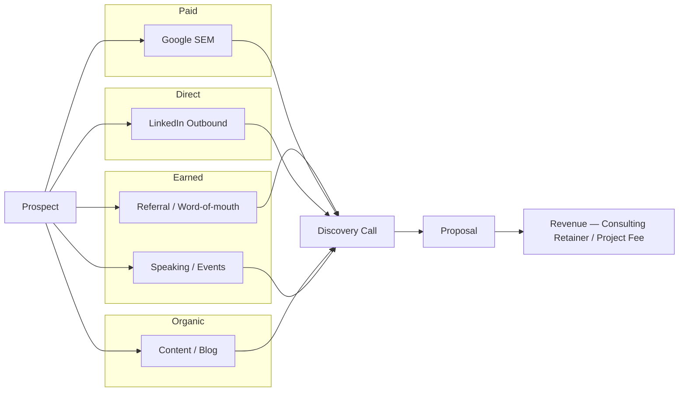

# Revenue Channel Map — Harbourside Consulting Group

**Date:** 15/05/2026
**Business Stage:** $1–10M ARR
**Model:** B2B | Professional services (management consulting for mid-market property developers)
**Prepared by:** Revenue Channel Mapper skill

---

## Executive Summary

- Referrals account for 68% of revenue with a LTV:CAC of 9.2 — by far the highest-performing channel, but friction is 4 (founder-dependent, hard to scale).
- Google SEM generates 22% of revenue at an LTV:CAC of 2.8 — healthy, but rising CPCs have pushed CAC from $480 to $740 in 12 months. Needs optimisation.
- LinkedIn outbound (8% of revenue) has the worst LTV:CAC at 1.4 and the highest friction — recommended for immediate deprioritisation in favour of a structured referral programme.

---

## Channel Canvas

| Channel | Type | Monthly Volume | CAC (AUD) | LTV (AUD) | LTV:CAC | Contribution % | Friction (0–5) | Status |
|---------|------|---------------|-----------|-----------|---------|----------------|----------------|--------|
| Referral / word-of-mouth | Earned | 4 qualified leads | $220 | $28,000 | 9.2 | 68% | 4 | Active |
| Google SEM | Paid | 18 qualified leads | $740 | $21,000 | 2.8 | 22% | 1 | Active |
| LinkedIn outbound | Direct | 6 qualified leads | $1,900 | $16,500 [est] | 1.4 | 8% | 4 | Active |
| Content marketing (blog) | Organic | 2 inbound inquiries | $380 [est] | $24,000 [est] | 6.3 [est] | 2% | 2 | Active — low volume |
| Industry events / speaking | Earned | 1 lead/quarter | $2,400 [est] | $35,000 [est] | 14.6 [est] | 0% | 5 | Occasional |
| Email to past clients | Owned | — | $40 [est] | $18,000 [est] | — | 0% | 0 | Dormant |

> Cells marked `[est]` are estimates based on director recall — no CRM data available for these channels.

---

## Revenue Flow Map

---

## RICE Prioritisation

| Channel | Reach (1–10) | Impact (1–3) | Confidence | Effort (wks) | RICE Score | Recommendation |
|---------|-------------|-------------|-----------|-------------|-----------|----------------|
| Referral programme (formalised) | 5 | 3 | 80% | 2 | 60.0 | **Invest — highest priority** |
| Content marketing (scale) | 6 | 2 | 50% | 3 | 20.0 | **Invest — medium priority** |
| Email to past clients (reactivate) | 4 | 2 | 80% | 1 | 51.2 [est] | **Invest — quick win** |
| Google SEM (optimise) | 7 | 2 | 80% | 2 | 44.8 | Invest — optimise, don't scale |
| Speaking / events (systematic) | 3 | 3 | 50% | 4 | 11.3 | Hold — revisit Q4 |
| LinkedIn outbound | 5 | 1 | 80% | 4 | 10.0 | **Deprioritise** |

**Top 3 to invest:** Formalised referral programme, Past-client email reactivation, Content marketing scale-up
**Deprioritise:** LinkedIn outbound (cut to ≤ 2 hrs/week), Speaking (attend only if invited — no self-submission)

---

## 90-Day Experiment Plan

| # | Channel | Hypothesis | Success Metric | Budget (AUD) | Effort | Owner | Start | Kill Criterion |
|---|---------|-----------|---------------|-------------|--------|-------|-------|----------------|
| 1 | Referral programme | If we introduce a structured referral ask (email + call script) at 60-day client mark, referral leads will increase from 4 to 7/month in 90 days | Referral leads ≥ 7/month by day 90 | $0 direct + 3d setup | 3d | Client Success Lead | Wk 1 | < 5 leads/month by day 60 |
| 2 | Past-client email reactivation | If we send a 3-email sequence to 47 past clients offering a complimentary 30-min strategy call, ≥ 4 will re-engage within 30 days | Re-engaged clients ≥ 4 within 30 days | $0 (internal) | 2d | Principal Consultant | Wk 2 | < 2 responses by day 21 |
| 3 | Content marketing | If we publish 2 long-form case studies/month targeting "property development feasibility Melbourne", organic leads will reach 6/month within 90 days | Organic leads ≥ 6/month by day 90 | $1,200 (copywriter) | 4d | Marketing Coordinator | Wk 1 | < 3 organic leads/month by day 60 |

---

## Assumptions & Data Gaps

| Channel | Field | Assumption | Data Needed to Sharpen |
|---------|-------|-----------|----------------------|
| LinkedIn outbound | LTV | $16,500 — assumed lower than referral as no long-term retainers from this channel | Pull actual contract values from Xero for LinkedIn-sourced clients |
| Content marketing | CAC | $380 — estimated based on 2 leads/month from blog, ~$760/month content cost | Google Analytics goal tracking to attribute leads accurately |
| Speaking / events | CAC | $2,400 — includes travel + time; assumed 1 lead per event | Track leads by source in CRM |
| Email reactivation | LTV | $18,000 — discounted from referral LTV as re-engagements tend to be shorter projects | Tag re-engagement deals in Xero post-campaign |

---

## Next Steps

1. Set up a simple CRM (HubSpot Starter) to track lead source — current data gaps make 4 of 6 channels untrackable.
2. Brief Client Success Lead on referral programme protocol by 22/05/2026 — this is the highest RICE channel.
3. Export past-client list from Xero and build email sequence in Mailchimp by 29/05/2026.
