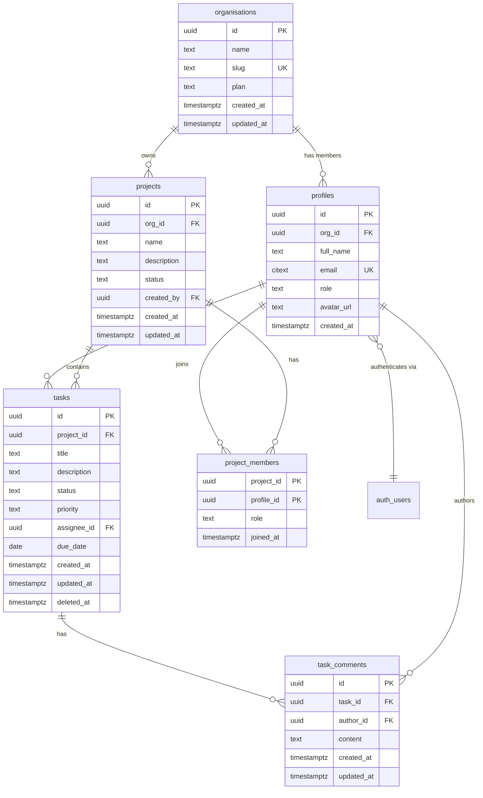

# Data Dictionary: TaskFlow Project Management

> Generated on 2026-04-04 | Source: PostgreSQL (Supabase) | Generator: data-dictionary-generator

---

## Schema Overview

| Metric | Value |
|--------|-------|
| Database type | PostgreSQL 15 (Supabase) |
| Schema | public |
| Total tables | 6 |
| Total columns | 34 |
| Total relationships | 9 |
| PII columns detected | 3 |
| Schema version / last migration | 20260401120000 |

---

## Table Dictionary

### organisations

**Description:** Top-level tenant entity representing a company or team that owns projects and members. All business data is scoped to an organisation.

**Purpose:** Transactional (tenant root)

**Estimated rows:** 1,200

| Column | Type | Nullable | Default | Description | PII |
|--------|------|----------|---------|-------------|-----|
| id | uuid | No | gen_random_uuid() | Unique identifier for the organisation | -- |
| name | text | No | -- | Display name of the organisation | -- |
| slug | text | No | -- | URL-friendly unique identifier used in permalinks | -- |
| plan | text | No | 'free' | Current subscription plan (free, pro, enterprise) | -- |
| created_at | timestamptz | No | now() | Timestamp when the organisation was created | -- |
| updated_at | timestamptz | No | now() | Timestamp when the organisation was last modified | -- |

**Constraints:**
- PRIMARY KEY: `id`
- UNIQUE: `slug`
- CHECK: `plan IN ('free', 'pro', 'enterprise')`

**Indexes:**
- `organisations_pkey` on `(id)` [btree]
- `organisations_slug_key` on `(slug)` [btree, unique]

---

### profiles

**Description:** User profile information linked to Supabase authentication. Each profile belongs to an organisation and represents a team member.

**Purpose:** User/Identity

**Estimated rows:** 8,500

| Column | Type | Nullable | Default | Description | PII |
|--------|------|----------|---------|-------------|-----|
| id | uuid | No | -- | References auth.users(id); unique identifier for the user | -- |
| org_id | uuid | No | -- | Organisation this profile belongs to (multi-tenancy key) | -- |
| full_name | text | No | -- | User's display name | PII: Name (Medium) |
| email | citext | No | -- | User's email address, case-insensitive | PII: Email (Medium) |
| role | text | No | 'member' | Role within the organisation (owner, admin, member) | -- |
| avatar_url | text | Yes | NULL | URL to the user's profile image | PII: Biometric-adj. (Low) |
| created_at | timestamptz | No | now() | Timestamp when the profile was created | -- |

**Constraints:**
- PRIMARY KEY: `id`
- FOREIGN KEY: `id` references `auth.users(id)` ON DELETE CASCADE
- FOREIGN KEY: `org_id` references `organisations(id)` ON DELETE CASCADE
- UNIQUE: `email`
- CHECK: `role IN ('owner', 'admin', 'member')`

**Indexes:**
- `profiles_pkey` on `(id)` [btree]
- `profiles_org_id_idx` on `(org_id)` [btree]
- `profiles_email_key` on `(email)` [btree, unique]

---

### tasks

**Description:** Individual work items within a project. Tasks track assignment, priority, status, and due dates. Supports soft deletion via the deleted_at column.

**Purpose:** Transactional

**Estimated rows:** 145,000

| Column | Type | Nullable | Default | Description | PII |
|--------|------|----------|---------|-------------|-----|
| id | uuid | No | gen_random_uuid() | Unique identifier for the task | -- |
| project_id | uuid | No | -- | Project this task belongs to | -- |
| title | text | No | -- | Short summary of the task | -- |
| description | text | Yes | NULL | Detailed description or acceptance criteria | -- |
| status | text | No | 'todo' | Current workflow status (todo, in_progress, review, done) | -- |
| priority | text | No | 'medium' | Task priority level (low, medium, high, urgent) | -- |
| assignee_id | uuid | Yes | NULL | Profile assigned to complete this task | -- |
| due_date | date | Yes | NULL | Target completion date | -- |
| created_at | timestamptz | No | now() | Timestamp when the task was created | -- |
| updated_at | timestamptz | No | now() | Timestamp when the task was last modified | -- |
| deleted_at | timestamptz | Yes | NULL | Soft delete timestamp; non-null means logically deleted | -- |

**Constraints:**
- PRIMARY KEY: `id`
- FOREIGN KEY: `project_id` references `projects(id)` ON DELETE CASCADE
- FOREIGN KEY: `assignee_id` references `profiles(id)` ON DELETE SET NULL
- CHECK: `status IN ('todo', 'in_progress', 'review', 'done')`
- CHECK: `priority IN ('low', 'medium', 'high', 'urgent')`

**Indexes:**
- `tasks_pkey` on `(id)` [btree]
- `tasks_project_id_idx` on `(project_id)` [btree]
- `tasks_assignee_id_idx` on `(assignee_id)` [btree]
- `tasks_status_idx` on `(status)` WHERE `deleted_at IS NULL` [btree, partial]

---

## Relationship Map

| From Table | From Column | To Table | To Column | Type | Cardinality | Source |
|-----------|-------------|----------|-----------|------|-------------|--------|
| profiles | id | auth.users | id | FK | 1:1 | Explicit |
| profiles | org_id | organisations | id | FK | N:1 | Explicit |
| projects | org_id | organisations | id | FK | N:1 | Explicit |
| projects | created_by | profiles | id | FK | N:1 | Explicit |
| tasks | project_id | projects | id | FK | N:1 | Explicit |
| tasks | assignee_id | profiles | id | FK | N:1 | Explicit |
| task_comments | task_id | tasks | id | FK | N:1 | Explicit |
| task_comments | author_id | profiles | id | FK | N:1 | Explicit |
| project_members | project_id | projects | id | FK | N:1 | Explicit (junction) |
| project_members | profile_id | profiles | id | FK | N:1 | Explicit (junction) |

---

## Entity Relationship Diagram

---

## Data Patterns

### Detected Conventions

| Pattern | Tables Affected | Details |
|---------|----------------|---------|
| Soft delete | tasks | `deleted_at` column enables logical deletion without data loss |
| Multi-tenancy | profiles, projects | `org_id` column scopes data to an organisation |
| Audit trail (timestamps) | All 6 tables | `created_at` present on all tables; `updated_at` on 4 of 6 |
| Supabase auth integration | profiles | `profiles.id` references `auth.users(id)` for authentication |
| Junction table | project_members | Composite PK links projects and profiles in a many-to-many relationship |
| URL-friendly slug | organisations | `slug` column provides permalink identifiers |

### PII Summary

| Table | Column | PII Type | Sensitivity | Recommendation |
|-------|--------|----------|-------------|----------------|
| profiles | full_name | Name | Medium | Audit access; mask in non-production environments |
| profiles | email | Email | Medium | Audit access; mask in non-production environments |
| profiles | avatar_url | Biometric-adjacent | Low | Review data retention policy |

### Audit Trail Coverage

| Table | created_at | updated_at | created_by | updated_by | Soft Delete |
|-------|-----------|-----------|-----------|-----------|-------------|
| organisations | Yes | Yes | No | No | No |
| profiles | Yes | No | No | No | No |
| projects | Yes | Yes | Yes | No | No |
| tasks | Yes | Yes | No | No | Yes (deleted_at) |
| task_comments | Yes | Yes | No | No | No |
| project_members | Yes (joined_at) | No | No | No | No |

---

## Recommendations

| # | Severity | Table/Column | Recommendation |
|---|----------|-------------|----------------|
| 1 | Medium | profiles | Add `updated_at` column to track when profile information is modified. Currently only `created_at` is recorded. |
| 2 | Medium | tasks | Add `created_by` column (FK to profiles) to track who created each task. Projects have this but tasks do not. |
| 3 | Low | task_comments | Consider adding `edited_at` or a boolean `is_edited` flag so users can see when comments have been modified. |
| 4 | Low | organisations | Add `updated_by` and `created_by` audit columns to track which admin modified organisation settings. |

---

*End of data dictionary.*
