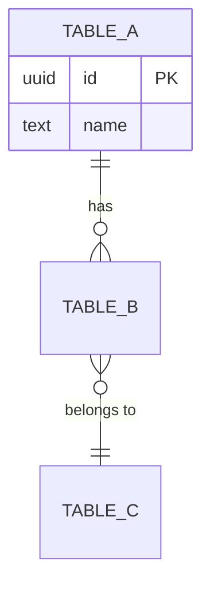

# Data Dictionary: {project_name}

> Generated on {date} | Source: {source_type} | Generator: data-dictionary-generator

---

## Schema Overview

| Metric | Value |
|--------|-------|
| Database type | {database_type} |
| Schema | {schema_name} |
| Total tables | {table_count} |
| Total columns | {column_count} |
| Total relationships | {relationship_count} |
| PII columns detected | {pii_count} |
| Schema version / last migration | {schema_version} |

---

## Table Dictionary

### {table_name}

**Description:** {table_description}

**Purpose:** {Reference | Transactional | Junction | Audit | Configuration | User/Identity}

**Estimated rows:** {row_count}

| Column | Type | Nullable | Default | Description | PII |
|--------|------|----------|---------|-------------|-----|
| {column_name} | {data_type} | {yes/no} | {default_value} | {column_description} | {pii_flag} |
| ... | ... | ... | ... | ... | ... |

**Constraints:**
- PRIMARY KEY: `{pk_columns}`
- FOREIGN KEY: `{fk_column}` references `{foreign_table}({foreign_column})` ON DELETE {action}
- UNIQUE: `{unique_columns}`
- CHECK: `{check_expression}`

**Indexes:**
- `{index_name}` on `({index_columns})` [{btree | gin | gist | hash}]

---

*Repeat the above block for each table in the schema.*

---

## Relationship Map

| From Table | From Column | To Table | To Column | Type | Cardinality | Source |
|-----------|-------------|----------|-----------|------|-------------|--------|
| {from_table} | {from_column} | {to_table} | {to_column} | FK | {1:1 | 1:N | M:N} | Explicit |
| {from_table} | {from_column} | {to_table} | {to_column} | Inferred | {cardinality} | [Inferred] |

---

## Entity Relationship Diagram

---

## Data Patterns

### Detected Conventions

| Pattern | Tables Affected | Details |
|---------|----------------|---------|
| {pattern_name} | {table_list} | {pattern_details} |

### PII Summary

| Table | Column | PII Type | Sensitivity | Recommendation |
|-------|--------|----------|-------------|----------------|
| {table} | {column} | {pii_type} | {Low | Medium | High | Critical} | {recommendation} |

### Audit Trail Coverage

| Table | created_at | updated_at | created_by | updated_by | Soft Delete |
|-------|-----------|-----------|-----------|-----------|-------------|
| {table} | {yes/no} | {yes/no} | {yes/no} | {yes/no} | {yes/no} |

---

## Recommendations

| # | Severity | Table/Column | Recommendation |
|---|----------|-------------|----------------|
| 1 | {High | Medium | Low} | {target} | {actionable_recommendation} |
| 2 | ... | ... | ... |

---

*End of data dictionary.*
