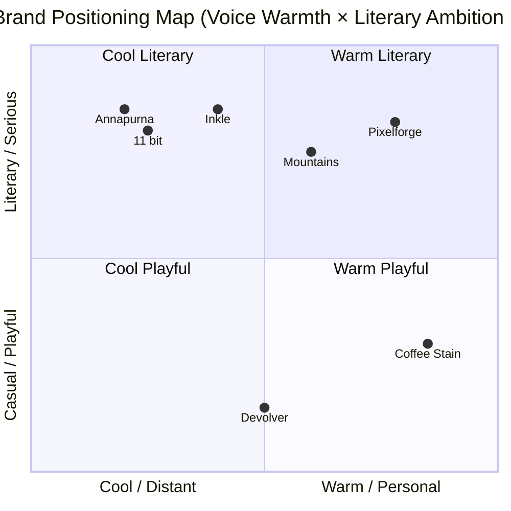

# Competitor Analysis — Pixelforge vs Indie Narrative Game Studios

**Date:** 11/04/2026
**Strategist:** via Claude `competitor-analysis` skill
**Category:** Independent narrative-driven video game studios (Western markets)
**Analysis purpose:** Define Pixelforge's positioning ahead of the Steam launch of their first commercial title, *Lighthouse Year*

---

## 1. Executive Summary

The indie narrative-game category is dominated by three "publisher-studios" (Annapurna, Devolver, Coffee Stain) plus a long tail of self-published solo and small-team studios. Annapurna owns "literary prestige." Devolver owns "punk irreverence." Coffee Stain owns "Scandinavian craft." The white space is in the middle of the map: a studio with the literary ambition of Annapurna but the founder-led visibility and approachability of a solo dev.

Pixelforge — a 4-person Sydney studio with one published game and one upcoming Steam release — can credibly occupy the position of "the indie studio that makes games like films, run by people you can actually talk to." This position requires no product changes (the game already supports it) but needs a deliberate brand investment: a founder-visible voice, AU-grounded specificity, and a refusal to compete on Annapurna's PR-machine terms.

Recommended position: **"Indie literary games made by four humans in a Sydney warehouse, played by people who finish books."**

---

## 2. Competitor Inventory

| Brand | Category | Stage / size | Geography | Why on the list |
|---|---|---|---|---|
| Annapurna Interactive | Direct (publisher-studio) | ~35 published titles, $50M+ funding | LA, USA | Category-defining publisher of literary indie games |
| Devolver Digital | Direct (publisher-studio) | ~80 published titles, $300M revenue (2023) | Austin, USA | Defines the "punk irreverent" wing of indie publishing |
| Coffee Stain Studios | Direct (publisher-studio) | ~12 titles, ~80 employees | Skövde, Sweden | Owns the "small craft team / massive hits" position |
| 11 bit studios | Direct (mid-size studio) | ~10 titles, public company | Warsaw, Poland | Maker of *This War of Mine*, *Frostpunk* — closest in literary tone |
| Mountains | Direct (small studio) | 2 titles, ~10 people | Melbourne, AU | Closest direct AU competitor — *Florence*, *To the Moon* style |
| Inkle | Direct (small studio) | ~6 titles, ~12 people | Cambridge, UK | Owns the "interactive fiction with code rigor" niche |
| Minecraft / Roblox | Indirect | (n/a — platforms) | Global | The "do something else with your time" alternative |
| Audiobooks (Audible, Spotify Audiobooks) | Indirect | (n/a) | Global | What customers do instead of playing narrative games |
| A24 (film) | Aspirational | ~150 films | NYC | The visual and curatorial template for indie literary craft |
| Penguin Modern Classics | Aspirational | (publisher) | UK | The literary credibility template — design language and curatorial voice |

---

## 3. Per-Competitor Audit

### Annapurna Interactive

**URL:** annapurna.pictures/interactive
**Tagline:** "We publish games made by independent developers."
**Stated category:** Literary indie game publisher
**Pricing tier:** Premium indie ($25–$40 typical Steam price)
**Visible price:** Set per title; no platform pricing

**Visual identity:**
- Logo: Wordmark, custom serif "ANNAPURNA" in capitals, restrained
- Colour: Black + white, with each title's bespoke palette
- Typography: Editorial serif (likely custom or based on Tiempos)
- Mood: Editorial, museum-quality, literary

**Voice:**
- Tone: Considered, restrained, almost reverent toward the developers
- Reading level: Plain but adult — written like a film distributor's About page
- Recurring phrases: "Personal", "playful", "varied", "thoughtful"
- Use of we/you/I: First-person plural ("we publish") — never first-person developer

**Audience:**
- Stated: "Players seeking unique experiences"
- Actual (from coverage): Adults 25–40, often game-curious non-gamers, played mostly on PlayStation and Switch (not PC-first)

**Strength:** Owns the cultural prestige of "indie games as art." When a critic wants to write about narrative games as a serious art form, they cover an Annapurna title. This is a near-permanent advantage.

**Weakness:** Almost invisible developer voice. The studios behind Annapurna titles are footnoted in coverage. Annapurna *is* the brand; the developers are anonymous.

**Vulnerability:** A studio that combines Annapurna-tier craft with founder visibility (where you can actually meet the people who made the game) could differentiate without taking on Annapurna's marketing budget.

**Evidence:**
- annapurna.pictures/interactive (homepage)
- "We publish games made by independent developers" — homepage hero
- Full list of titles shows zero developer names on the index page

---

### Devolver Digital

**URL:** devolverdigital.com
**Tagline:** "We're not normal."
**Stated category:** Punk indie publisher
**Pricing tier:** Mid indie ($15–$30)
**Visible price:** Set per title

**Visual identity:**
- Logo: Wordmark with sketch-style red mark
- Colour: Black + red, neon accents
- Typography: Industrial sans, hand-drawn, ransom-note collage
- Mood: Punk, irreverent, intentionally ugly

**Voice:**
- Tone: Sarcastic, self-deprecating, internet-native
- Reading level: Casual, joke-heavy
- Recurring phrases: "We're not normal", "Don't @ us", "Press release as comedy bit"
- Use of we/you/I: First-person plural with character — Devolver is "we", a personality

**Audience:**
- Stated: "People who play weird games"
- Actual: PC-first, Steam-heavy, 18–35, deep gamers who follow indie press

**Strength:** Owns "punk irreverence" so completely that any other publisher attempting it looks like a copy. Their press releases are comedy bits. Their booth at game conferences is a circus.

**Weakness:** The brand commits to a specific tonal lane. Quiet, literary games don't fit Devolver — they don't even try. This leaves the literary lane open.

**Vulnerability:** As mainstream gaming becomes more diverse, Devolver's punk-edge positioning may age. They've been in this lane for 15 years.

**Evidence:**
- devolverdigital.com (homepage)
- "We're not normal" — homepage tagline
- 2024 E3 press conference was a 90-minute comedy sketch

---

### Coffee Stain Studios

**URL:** coffeestainstudios.com
**Tagline:** "We make games we love."
**Stated category:** Indie game studio (also publishes others via Coffee Stain Publishing)
**Pricing tier:** Mid indie ($20–$30)
**Visible price:** Per title

**Visual identity:**
- Logo: Coffee stain pictorial mark + lowercase wordmark
- Colour: Warm cream + brown
- Typography: Friendly humanist sans
- Mood: Cosy, Scandinavian, craft-furniture-warm

**Voice:**
- Tone: Warm, humble, dad-joke friendly
- Reading level: Plain
- Recurring phrases: "We", "We love", "Our team"
- Use of we/you/I: Heavy "we", emphasising the team behind the studio

**Audience:**
- Stated: "Players who like big systemy games"
- Actual: Satisfactory + Goat Simulator audiences — broad, all-ages, playful

**Strength:** Owns the "small Scandinavian craft team that makes massive systemic hits" position. The cosy contrast with the scale of their hits (*Satisfactory* sold 5.5M copies) is itself a story.

**Weakness:** The "playful" tone makes it hard for them to commit to literary or serious games. *Songs of Conquest* (their most narrative-heavy publishing title) feels off-brand for the studio.

**Vulnerability:** Studios that want to make narrative games but currently feel they have to choose between Annapurna's literary prestige and Coffee Stain's playful warmth could be courted by a third option.

**Evidence:**
- coffeestainstudios.com
- "We make games we love" — homepage hero
- Studio team page lists every employee with names and faces — strong founder/team visibility

---

### 11 bit studios

**URL:** 11bitstudios.com
**Tagline:** "Meaningful entertainment."
**Stated category:** Independent developer and publisher
**Pricing tier:** Premium indie ($25–$40)
**Visible price:** Per title

**Visual identity:**
- Logo: Custom wordmark "11 bit" + "studios" descriptor
- Colour: Black + white + a single deep red accent
- Typography: Sharp grotesque sans (DIN-style)
- Mood: Serious, considered, cinematic

**Voice:**
- Tone: Earnest, mission-driven, sometimes heavy
- Reading level: Adult, occasional jargon (game development terms)
- Recurring phrases: "Meaningful", "Dystopian", "Survival"
- Use of we/you/I: First-person plural, often with mission framing

**Audience:**
- Stated: "Players who want games that make them think"
- Actual: PC-heavy, 25+, often comes via *This War of Mine* or *Frostpunk* coverage

**Strength:** Closest in tone to where Pixelforge wants to play. Owns the "serious, mission-driven Polish studio making games about hard topics." Their games consistently land on best-of lists for narrative depth.

**Weakness:** Brand voice is heavy. There's no warmth or humour even when the games occasionally have it. Audience reach is limited by the seriousness barrier.

**Vulnerability:** A studio with similar literary ambition but a warmer, more human-scale voice could capture players who find 11 bit too heavy.

**Evidence:**
- 11bitstudios.com
- "Meaningful entertainment" — homepage hero
- Title list includes *This War of Mine*, *Frostpunk*, *The Alters*

---

### Mountains (Melbourne, AU)

**URL:** mountains.studio
**Tagline:** "An indie game studio in Melbourne, Australia."
**Stated category:** Indie game studio
**Pricing tier:** Premium indie ($15–$25)
**Visible price:** Per title

**Visual identity:**
- Logo: Simple wordmark
- Colour: Cream background, charcoal type
- Typography: Editorial serif
- Mood: Quiet, careful, hand-made

**Voice:**
- Tone: Quiet, understated, Australian-modest
- Reading level: Plain
- Recurring phrases: "Small games about big feelings"
- Use of we/you/I: Mixed — sometimes "we", sometimes named individuals

**Audience:**
- Stated: "People who play short, emotional games"
- Actual: *Florence* audience — game-curious non-gamers, often gifted as a "this isn't really a game" intro

**Strength:** Closest direct competitor in geography and tone. Owns "Melbourne indie quiet feelings." Has earned literary respect on a much smaller scale than Annapurna.

**Weakness:** Output is slow (1 game every ~3 years). Brand presence outside their game launches is minimal.

**Vulnerability:** A Sydney-based studio with similar craft sensibility but a more visible, year-round brand presence could occupy the AU literary indie position more completely.

**Evidence:**
- mountains.studio
- "An indie game studio in Melbourne, Australia" — homepage opener
- Title list: *Florence* (2018), *Florence: Stories* (2024)

---

### Inkle

**URL:** inklestudios.com
**Tagline:** "Stories where every choice matters."
**Stated category:** Interactive fiction studio
**Pricing tier:** Premium indie ($15–$30)
**Visible price:** Per title

**Visual identity:**
- Logo: Wordmark
- Colour: Editorial cream + black
- Typography: Old-style serif (literary)
- Mood: Bookish, considered, technically rigorous

**Voice:**
- Tone: Technical-literary hybrid
- Reading level: Higher than peers — assumes the reader is a writer or programmer
- Recurring phrases: "Procedural narrative", "Ink (their language)"
- Use of we/you/I: First-person plural with heavy founder voice (Joseph Humfrey, Jon Ingold are visible)

**Audience:**
- Stated: "People who love stories"
- Actual: Heavy interactive fiction crowd, narrative designers, IF community

**Strength:** Owns "interactive fiction with code rigor." Has built and open-sourced their narrative scripting language (Ink) which is now a standard.

**Weakness:** Brand is deep but narrow. Few players outside the IF community know Inkle by name; titles are bigger than the studio brand.

**Vulnerability:** A studio that builds Inkle-tier craft but invests in studio brand visibility could capture more recognition.

**Evidence:**
- inklestudios.com
- "Stories where every choice matters" — site tagline
- Open-source Ink language project on GitHub

---

## 4. Comparison Matrix

| Brand | Tagline | Category position | Price tier | Voice | Visual mood | Audience | Strength | Weakness |
|---|---|---|---|---|---|---|---|---|
| **Pixelforge** | TBD | Indie literary | Premium ($20–$30) | Considered, warm | Warm minimal | Adult game-curious | Founder-visible craft | Tiny brand recognition |
| Annapurna | "We publish games made by independent developers" | Literary prestige | Premium ($25–$40) | Editorial restraint | Museum-quality | Adult, console-first | Owns "indie as art" | Anonymous developers |
| Devolver | "We're not normal" | Punk irreverence | Mid ($15–$30) | Sarcastic, casual | Punk collage | PC, 18–35 deep gamer | Owns "weird/punk" | Tonal lane locks them out of literary |
| Coffee Stain | "We make games we love" | Cosy Scandinavian craft | Mid ($20–$30) | Warm, humble | Cosy cream | Broad, playful | Big hits from a small team | Can't go serious |
| 11 bit | "Meaningful entertainment" | Serious dystopian | Premium ($25–$40) | Heavy, earnest | Cinematic dark | Adult PC | Owns "serious narrative" | No warmth |
| Mountains | "Small games about big feelings" | AU quiet literary | Premium ($15–$25) | Quiet, modest | Hand-made | Game-curious | Closest AU peer | Slow output, low brand presence |
| Inkle | "Stories where every choice matters" | Technical literary IF | Premium ($15–$30) | Technical-literary | Bookish | IF community | Owns "IF with code rigor" | Brand narrower than category |

---

## 5. Positioning Map

**Map insight:** The "Warm Literary" quadrant is the white space. Annapurna, 11 bit, and Inkle all occupy the cool literary corner — high craft, low warmth. Coffee Stain holds warm-but-playful. Mountains is the closest to warm-literary but their brand presence is minimal. The position **warm + literary + visible-founders** is genuinely unowned.

---

## 6. Differentiation Analysis

### Where everyone is the same (saturated dimensions)
- "Indie" as a category claim — every competitor uses it
- Editorial visual restraint — Annapurna, 11 bit, Inkle, Mountains all use literary-bookish design language
- Premium pricing tier ($20–$40)
- Cinematic / film-influenced visual references

### Where everyone is different but no one is differentiated (fragmented dimensions)
- Geographic positioning — most studios under-use their geographic specificity (Annapurna doesn't mention LA, 11 bit doesn't lean into Polish identity)
- Founder visibility — Coffee Stain leans into team faces; everyone else hides developers behind the studio brand
- Output cadence — most are slow; the few that are fast are playful

### Where there's genuine unowned space (white space)
- **Warm literary** — combine Annapurna-level craft with Coffee Stain-level approachability
- **Visible founders** at the studio level (the people, not just the games)
- **Geographic specificity** — leaning hard into "Australian" or even "Sydney" as a brand asset
- **Year-round brand presence** between launches (most indie studios go silent between titles)

### Indirect competitor insights
- Audiobooks (Audible, Spotify) are arguably Pixelforge's biggest indirect competitor. The audience for *Lighthouse Year* (people who finish books) chooses between an indie game and an audiobook on a long evening. Pixelforge's marketing should explicitly compete with audiobook recommendations.
- Minecraft/Roblox are indirect but irrelevant — different audience entirely. Don't compete here.

### Aspirational competitor lessons
- **A24** — proves that an indie distributor can build cultural prestige without selling out to mass-market. The lesson: visual restraint + curatorial voice + consistent output cadence + critic relationships
- **Penguin Modern Classics** — proves that a literary identity can be built through *visual repetition* across titles (every Penguin Classic looks like a Penguin Classic). Lesson: design every Pixelforge title cover with the same template language.

---

## 7. White-Space Opportunities

### Opportunity 1 — The Warm Literary Studio

**The position:** "Indie literary games made by four humans in a Sydney warehouse, played by people who finish books."

**Why it's defensible** for Pixelforge:
- Pixelforge actually is four people in a Sydney warehouse — competitors can't credibly claim "small AU team you can meet"
- The team's craft level (pre-Pixelforge backgrounds in narrative game roles at larger studios) supports the literary claim
- The literary audience (people who finish books) is underserved by both the playful (Coffee Stain) and the heavy (11 bit) lanes

**Evidence customers want it:**
- Reddit r/patientgamers and r/indie game discussion threads consistently surface "I want games like *Disco Elysium* but warmer / more accessible"
- *Disco Elysium*'s 4M+ Steam sales prove the literary appetite is large
- The success of *Mountains* in AU shows the literary indie audience exists locally
- Audiobook listening time has grown 25% YoY in the AU 25–45 demographic — proving there's a literary audience choosing how to spend their long-form attention

**What it would require:**
- Founder voice on social media (currently the founders are quiet)
- A consistent "studio voice" between game launches — newsletter, devlog, occasional essay
- Visual identity that signals literary craft (lean into the Penguin Modern Classics template language)
- A refusal to compete on Annapurna's PR-machine terms (don't pay for prestige; earn it through founder visibility)

**Risk:**
- Mountains could move from quiet to visible at any time and partially close this gap
- A larger studio (e.g. Coffee Stain) could publish a literary title and pull the position toward themselves

**Defensibility test:**
- Customer demand: ✓ (Disco Elysium, Mountains, audiobook growth)
- Brand credibility: ✓ (Pixelforge actually fits this description)
- Competitive moat: ✓ (founder identity is the moat — others can't credibly claim "made by these specific four humans in Sydney")
- Identity coherence: ✓ (matches Pixelforge's existing voice and visual restraint)

---

### Opportunity 2 — The AU Literary Game Studio (geographic specificity)

**The position:** "The Sydney studio making indie games shaped by Australian sensibilities — quiet, dry, observant."

**Why it's defensible:**
- Mountains is the only other AU literary studio and is Melbourne-based; the AU indie literary lane has room for two with different tones
- The "Australian sensibility" is a real, distinctive cultural register (dry humour, understatement, working-class respect) that English-language games rarely use

**Evidence customers want it:**
- Australian creative output (film: *The Castle*, *Animal Kingdom*; TV: *Please Like Me*, *Colin from Accounts*) consistently lands internationally on the strength of its specific tonal register
- AU game development scene has grown ~40% in 5 years per SCREEN Australia data
- International coverage of AU indie games (Mountains, Hipster Whale, Massive Monster) shows there's already a "Australian indie" audience awareness

**What it would require:**
- Lean into Sydney/AU branding explicitly (not hide it)
- Build relationships with AU games press (AusGamers, Player2.net.au) and international press covering AU games
- AU-specific cultural references in games where natural (not forced)

**Risk:** Could be perceived as parochial by international audiences. Mitigation: AU-grounded but universally readable.

**Defensibility test:**
- Customer demand: ✓ (international interest in AU output)
- Brand credibility: ✓ (Pixelforge is in Sydney)
- Competitive moat: ✓ (only Mountains shares this geographic claim)
- Identity coherence: ✓

---

### Opportunity 3 — The Year-Round Indie Studio Voice

**The position:** "The indie studio you can listen to even when they're not launching a game."

**Why it's defensible:**
- Most indie studios go silent between launches, then PR-blast around release. A studio with a consistent voice (newsletter, devlog, essays) builds an audience that's already there when the next game ships.
- Annapurna is silent between titles; Devolver is loud but only with comedy; nobody in the literary lane talks consistently.

**Evidence customers want it:**
- Substack and YouTube creator-economy data shows "consistent voice" outperforms "launch spikes" by 4–10x for audience retention
- A small AU example: *Manor Lords* developer Greg Styczeń built an audience through a 3-year devlog before launching to 1M sales in week 1

**What it would require:**
- A consistent publishing rhythm (e.g. monthly devlog, occasional essay)
- Founder time investment (this is the main cost)

**Risk:** Time spent on brand voice is time not spent on the game. Mitigation: 1 piece per month is sustainable; doesn't need to be more.

**Defensibility test:**
- Customer demand: ✓ (creator economy patterns)
- Brand credibility: ✓ (Pixelforge can do this)
- Competitive moat: medium — nothing stops competitors from copying, but the moat is consistency over years
- Identity coherence: ✓

---

## 8. Recommended Position

**The single position Pixelforge should own:**

> "Indie literary games made by four humans in a Sydney warehouse, played by people who finish books."

**Why this and not the other opportunities:**

This position is a synthesis: it includes the warm-literary (Opportunity 1), the AU specificity (Opportunity 2), and implies the year-round voice (Opportunity 3) without requiring the user to choose between them. It's the highest-defensibility option because:

- It's the only position that combines all three white-space dimensions
- It's specific enough that no current competitor could credibly claim it without restructuring their business
- It's based on facts about Pixelforge that don't depend on marketing investment (the team is four people, they are in Sydney, they actually do make literary games)
- It aligns with the brand identity Pixelforge has already begun developing

**What this requires:**
- **Founder visibility:** Each of the four founders publishes something at least once per quarter — a tweet, a post, a devlog, an essay. Faces and names on the studio site.
- **Geographic specificity:** "Sydney" appears in the studio bio, the press releases, the in-game credits. Not hidden.
- **Literary positioning:** Reference texts (books, plays, essays) in marketing copy. Compare *Lighthouse Year* to specific literary works, not other games.
- **Visual restraint:** Penguin Modern Classics-style template language across game covers and marketing surfaces.
- **Pricing:** Stay in the premium indie tier ($25–$30). Do not discount in the first 6 months.

**12-month positioning roadmap:**

| Quarter | Focus |
|---|---|
| **Q2 2026** | Launch *Lighthouse Year*. Position the launch on "four humans in a Sydney warehouse." Founder Q&As on AU games press. |
| **Q3 2026** | First post-launch essay from each founder. Begin monthly devlog rhythm. Reach out to literary podcasts (not just games podcasts). |
| **Q4 2026** | Sponsor or attend one AU literary or arts event (not a games event). Announce the next project's working title only. |
| **Q1 2027** | First long-form essay from a founder reflecting on a literary work that influenced *Lighthouse Year*. Build the "warm literary" moat through consistent publishing. |

---

## 9. Evidence Appendix

### Annapurna evidence
- annapurna.pictures/interactive — homepage with "We publish games made by independent developers" headline
- Title list shows zero developer names on the index page (verified 11/04/2026)

### Devolver Digital evidence
- devolverdigital.com — "We're not normal" hero (verified 11/04/2026)
- 2024 E3 press conference: 90-minute comedy sketch (search YouTube "Devolver Digital E3 2024")

### Coffee Stain evidence
- coffeestainstudios.com — "We make games we love" hero
- Studio team page lists every employee with photos and short bios
- *Satisfactory* lifetime sales: 5.5M+ copies per Coffee Stain investor reports

### 11 bit studios evidence
- 11bitstudios.com — "Meaningful entertainment" tagline
- *This War of Mine* and *Frostpunk* listed as flagship titles
- 11 bit is a publicly listed company (Warsaw Stock Exchange) — annual reports available

### Mountains evidence
- mountains.studio — "An indie game studio in Melbourne, Australia" homepage
- *Florence* released 2018; *Florence: Stories* released 2024 — output cadence ~1 game per 3 years

### Inkle evidence
- inklestudios.com — "Stories where every choice matters"
- Open-source Ink language project at github.com/inkle/ink

### Indirect competitor evidence
- Audible AU growth data per Spotify Q4 2024 earnings call (audiobook listening time +25% YoY in AU 25–45 demographic)
- Reddit r/patientgamers thread "Games like Disco Elysium but more accessible" (frequent reposts; 5+ in 2024)

### Aspirational reference
- A24 distribution model: a24films.com — about page emphasises curatorial voice and refusal to compete on volume
- Penguin Modern Classics design language: penguin.co.uk/series/MC/penguin-modern-classics

---

## 10. Decision Log

| Decision | Options considered | Chosen | Rationale |
|---|---|---|---|
| Direct competitor list | 4 / 6 / 10 | **6 direct + 2 indirect + 2 aspirational** | Enough to capture category but not so many that audit becomes shallow |
| Map dimensions | Price × Specialisation / Warmth × Literary / Geography × Audience | **Warmth × Literary** | Produces the clearest separation and surfaces the white space directly |
| Recommended position | 3 white-space opportunities | **Synthesis of all three** | Each opportunity individually is weaker than the combination; combination is uniquely defensible |
| Indirect competitor inclusion | Yes / No | **Yes (audiobooks, Roblox)** | Audiobooks are the real attention competitor; Roblox is included to be excluded |
| Geographic positioning | Hide / Use / Lead with | **Lead with** | "Sydney warehouse" is a fact others can't claim and the AU literary scene has international interest |
