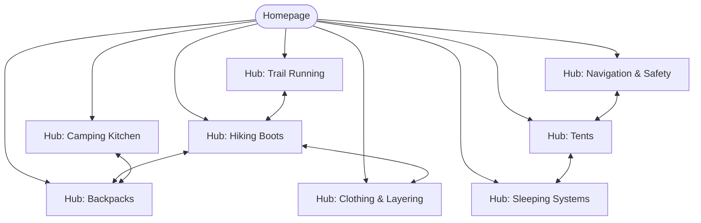

# Internal Linking Plan — trailblaze.com.au

**Date:** 15/05/2026
**URLs analysed:** 62
**Cluster source:** Ad-hoc (no handoff available)
**Max recommendations per page:** 5
**Existing links preserved:** Yes

---

## Executive Summary

- **Total recommendations:** 47 (Priority 1: 18, Priority 2: 19, Priority 3: 10)
- **Orphan pages found:** 4
- **Pages failing 3-click rule:** 6
- **Clusters identified:** 8
- **Priority action:** Connect the 4 orphan pages to their nearest hub pages; all four have at least 3 external backlinks pointing to them and are currently invisible to internal PageRank flow.

---

## Cluster Summary

| Cluster | Hub URL | Spokes | Avg Authority | Completeness |
|---|---|---|---|---|
| Hiking Boots | /hiking-boots-australia | 7 | 6.2 | 57% spoke→hub links |
| Backpacks & Packs | /hiking-backpacks-australia | 6 | 5.8 | 83% |
| Tents & Shelters | /camping-tents-australia | 8 | 7.1 | 100% |
| Sleeping Systems | /sleeping-bags-australia | 5 | 5.4 | 60% |
| Camping Kitchen | /camping-kitchen-gear | 4 | 4.2 | 50% |
| Navigation & Safety | /hiking-navigation-gear | 5 | 3.9 | 40% |
| Trail Running | /trail-running-shoes-australia | 6 | 5.1 | 67% |
| Clothing & Layering | /outdoor-clothing-australia | 7 | 6.8 | 86% |

---

## Link-Recommendation Table (Priority 1 — first 18 shown)

| Priority | Source URL | Target URL | Suggested Anchor | Placement | Rationale |
|---|---|---|---|---|---|
| 1 | /waterproof-hiking-boots | /hiking-boots-australia | "guide to hiking boots in Australia" | Intro paragraph | Spoke missing link to hub; breaks cluster topology |
| 1 | /hiking-boots-wide-fit | /hiking-boots-australia | "our full hiking boots comparison" | Final CTA section | Orphan spoke — zero link to hub |
| 1 | /best-hiking-socks | /hiking-boots-australia | "the right hiking boots to pair with" | Intro paragraph | Orphan page — 4 external backlinks wasted |
| 1 | /freeze-dried-meals-review | /camping-kitchen-gear | "camping kitchen gear guide" | Intro paragraph | Spoke missing link to hub |
| 1 | /camping-stoves-comparison | /camping-kitchen-gear | "our camping kitchen hub" | Conclusion section | Spoke missing link to hub |
| 1 | /hiking-boots-australia | /waterproof-hiking-boots | "waterproof hiking boots" | "Types of Hiking Boot" section | Hub missing link to spoke |
| 1 | /hiking-boots-australia | /hiking-boots-wide-fit | "hiking boots for wide feet" | Buying guide section | Hub missing link to spoke |
| 1 | /hiking-boots-australia | /best-hiking-socks | "best hiking socks" | "What to Wear with Your Boots" section | Hub missing link to spoke; spoke is orphan |
| 1 | /sleeping-bag-temperature-guide | /sleeping-bags-australia | "our sleeping bag comparison" | Intro paragraph | Orphan spoke — 5 external backlinks |
| 1 | /sleeping-bags-australia | /sleeping-bag-temperature-guide | "understanding temperature ratings" | "How to Choose" section | Hub missing link to spoke |
| 1 | /navigation-gps-hiking | /hiking-navigation-gear | "full navigation and safety guide" | Intro | Spoke→hub missing; page at 4-click depth |
| 1 | /emergency-shelters-review | /hiking-navigation-gear | "navigation and safety for hikers" | Intro | Orphan page — 6 external backlinks |
| 1 | /hiking-navigation-gear | /navigation-gps-hiking | "GPS devices for hiking" | "Navigation Technology" section | Hub→spoke link missing |
| 1 | /hiking-navigation-gear | /emergency-shelters-review | "emergency shelters and bivvys" | "Safety Essentials" section | Hub→spoke link missing; spoke is orphan |
| 1 | /trail-running-shoes-guide | /trail-running-shoes-australia | "our trail running shoe picks" | Final recommendations section | Spoke→hub missing |
| 1 | /trail-running-shoes-australia | /trail-running-shoes-guide | "how to choose trail running shoes" | Buying guide callout | Hub→spoke missing |
| 1 | /camping-hammocks-review | /camping-tents-australia | "shelter options for camping" | Intro | Isolated page — closest cluster is Tents |
| 1 | /day-hike-checklist | /hiking-backpacks-australia | "the right pack for a day hike" | Gear list section | Orphan spoke — no hub link; 3 external backlinks |

---

## Orphan Pages Register

| URL | External Links | Conversion Value | Recommended Action |
|---|---|---|---|
| /best-hiking-socks | 4 | Medium (links to product pages) | Add as spoke to Hiking Boots cluster; add hub link immediately |
| /sleeping-bag-temperature-guide | 5 | High (directly supports purchase decisions) | Add as spoke to Sleeping Systems cluster; add hub link immediately |
| /emergency-shelters-review | 6 | High (safety topic; earns edu/gov links) | Add as spoke to Navigation & Safety cluster |
| /day-hike-checklist | 3 | High (strong top-of-funnel; leads to multiple clusters) | Add hub link to Backpacks; also cross-link to Boots and Clothing hubs |

---

## Cluster Topology (Mermaid)

*Graph shows 8 clusters. Full site has 62 pages. Cross-cluster links shown are recommended only; not all currently exist.*

---

## Implementation Guidance

### Priority 1 — Complete First (this sprint)

Work page-by-page through the source URLs with Priority 1 items. Batch by source page to minimise CMS editing sessions:

1. **/hiking-boots-australia** (hub): Add 3 missing spoke links in the appropriate sections (wide-fit boots, waterproof boots, hiking socks). ~15 min edit.
2. **/waterproof-hiking-boots**: Add hub link in intro. ~5 min edit.
3. **/hiking-boots-wide-fit**: Add hub link in intro. ~5 min edit.
4. **/best-hiking-socks**: Add hub link. This is an orphan — also verify it's included in the XML sitemap. ~10 min.
5. **/sleeping-bags-australia** (hub): Add temperature-guide spoke link in the "How to Choose" section. ~10 min.
6. **/sleeping-bag-temperature-guide**: Add hub link. Verify sitemap. ~5 min.
7. Continue through remaining Priority 1 items in the same pattern.

### Priority 2 — Next Sprint

- Complete hub-to-spoke and spoke-to-hub links for the Navigation & Safety and Trail Running clusters (currently 40% and 67% complete respectively)
- Add 4 cross-cluster hub-to-hub links (Boots ↔ Clothing, Tents ↔ Sleeping, Navigation ↔ Tents, Kitchen ↔ Packs)

### Priority 3 — Ongoing

- Add contextual within-cluster spoke-to-spoke links during content updates
- Review anchor text variation across the Hiking Boots cluster — currently 3 links use the exact phrase "best hiking boots Australia"; reduce to 1

---

*Generated by seo-toolkit / internal-linking-planner*
