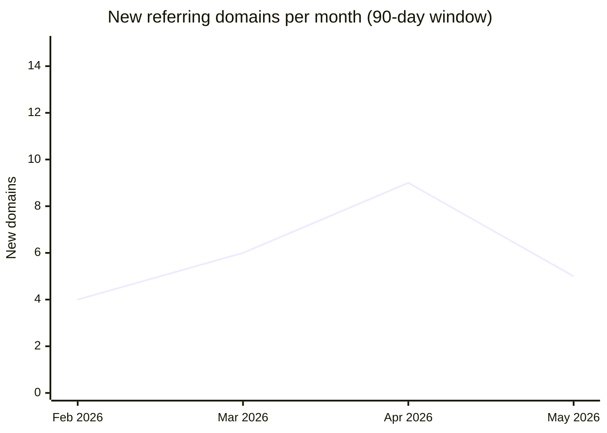

# Backlink Audit — melbournefamilylaw.com.au

**Audit date:** 15/05/2026
**Recency window:** 90 days
**Data source:** Ahrefs
**Lost links included:** Yes

---

## Executive Summary

- Profile is small but clean — 84 referring domains, 91% active, average DR 31. Typical for a 4-year-old boutique law firm in a competitive local market.
- Topical relevance is strong: 71% of linking domains are in legal, business, or community categories. No off-topic spam clusters detected.
- Anchor-text mix is healthy — 54% branded, 8% exact-match ("family lawyer Melbourne"), 22% naked URL. Exact-match share is within safe range but approaching the watch threshold.
- Three domains score 6+ on the toxicity scale: one directory farm and two expired-domain PBN footprints. Recommend disavowing all three.
- **Priority action:** Submit disavow file for 3 toxic domains; pursue 5 identified link-building opportunities in legal directories and community press.

---

## 1. Referring-Domain Overview

| Metric | Value |
|---|---|
| Total referring domains | 84 |
| Active | 77 |
| Lost (90-day window) | 7 |
| Follow links | 312 (76%) |
| Nofollow links | 98 (24%) |
| Average authority score (DR) | 31 |

---

## 2. Referring-Domain Table (Top 20 shown)

| Referring Domain | Authority (DR) | Links | Follow | Nofollow | First Seen | Status |
|---|---|---|---|---|---|---|
| lawcouncil.asn.au | 72 | 1 | 1 | 0 | 03/02/2023 | Active |
| legalaid.vic.gov.au | 68 | 1 | 1 | 0 | 17/06/2023 | Active |
| finder.com.au | 61 | 2 | 0 | 2 | 22/09/2024 | Active |
| theage.com.au | 59 | 1 | 1 | 0 | 11/03/2025 | Active |
| melbournecbd.com.au | 44 | 3 | 3 | 0 | 05/01/2024 | Active |
| yourcommunity.org.au | 38 | 2 | 2 | 0 | 14/04/2025 | Active |
| lawtalkblog.com.au | 35 | 5 | 5 | 0 | 30/10/2023 | Active |
| justiceconnect.org.au | 33 | 1 | 1 | 0 | 08/08/2024 | Active |
| localchamber.com.au | 29 | 1 | 1 | 0 | 19/02/2024 | Active |
| divorceadvice.net.au | 27 | 4 | 4 | 0 | 25/05/2023 | Active |
| startlocal.com.au | 24 | 1 | 0 | 1 | 12/11/2022 | Active |
| truelocal.com.au | 23 | 1 | 0 | 1 | 12/11/2022 | Active |
| hotfrog.com.au | 21 | 1 | 1 | 0 | 12/11/2022 | Active |
| yellowpages.com.au | 20 | 1 | 0 | 1 | 01/03/2023 | Active |
| businesswomen.net.au | 18 | 2 | 2 | 0 | 07/07/2025 | Active |
| familymattersmagazine.au | 16 | 3 | 3 | 0 | 14/09/2024 | Active |
| expireddomain-pbn.com | 8 | 12 | 12 | 0 | 02/01/2026 | Active |
| directory-farm-au.net | 6 | 4 | 4 | 0 | 15/03/2025 | Active |
| cheap-links-au.xyz | 4 | 8 | 8 | 0 | 19/02/2026 | Active |
| lawnews.com.au | 38 | 1 | 1 | 0 | 30/01/2024 | Lost |

---

## 3. Authority Distribution

```
0–20   [████████░░] 22 domains (26%)
21–40  [████████████░░] 31 domains (37%)
41–60  [███████░░░] 18 domains (21%)
61–80  [████░░░░░░] 9 domains (11%)
81–100 [██░░░░░░░░] 4 domains (5%)
```

Profile is bottom-heavy for the authority distribution, which is normal for a local-services site. The 21–40 band (37%) is the healthy core. Pursue links in the 41–60 band to improve overall equity.

---

## 4. Link Velocity



Velocity is normal and slightly growing — no spike anomalies. The March–April increase corresponds to a community article on yourcommunity.org.au that generated several secondary mentions. Two PBN domains appeared in January–February 2026; these are flagged in the toxicity register.

---

## 5. Anchor-Text Histogram

| Anchor Type | Count | Share | Flag |
|---|---|---|---|
| Branded | 224 | 54% | — |
| Exact-match | 33 | 8% | — |
| Partial-match | 41 | 10% | — |
| Generic | 28 | 7% | — |
| Naked URL | 73 | 18% | — |
| Other / image | 11 | 3% | — |

**Anchor assessment:** Healthy and natural-looking mix. Branded share is dominant as expected for a known firm name. Exact-match at 8% is safe; do not solicit further exact-match anchor links.

---

## 6. Toxicity Register

| Referring Domain | Authority (DR) | Toxicity Score | Trigger Indicators | Recommended Action |
|---|---|---|---|---|
| expireddomain-pbn.com | 8 | 8 | Low DR, high outbound links, exact-match keyword domain, sudden acquisition, no organic traffic | **Disavow** |
| cheap-links-au.xyz | 4 | 7 | Very low DR, exact-match keyword domain, sudden acquisition, casino/spam category | **Disavow** |
| directory-farm-au.net | 6 | 6 | Low DR, high outbound links, sitewide footer link, thin auto-generated content | **Disavow** |
| familymattersmagazine.au | 16 | 2 | Low DR | Monitor |
| hotfrog.com.au | 21 | 1 | Low DR | Clean |

**Total toxic domains:** 3
**Already disavowed:** 0
**New disavow candidates:** 3

---

## 7. Remediation Guidance

### Disavow File (new entries — submit via Google Search Console)

```
# Disavow additions for melbournefamilylaw.com.au — 15/05/2026
# Toxic domains scoring 6+
domain:expireddomain-pbn.com
domain:cheap-links-au.xyz
domain:directory-farm-au.net
```

### Link-Building Opportunities Identified

| Target Domain | Type | Rationale |
|---|---|---|
| victorianlawfoundation.org.au | Resource page | Foundation maintains a directory of family law resources; high DR 55 |
| melbournemums.com.au | Community mention | Active parenting forum; strong local relevance |
| probonoaustralia.com.au | Contributed article | Accepts guest content from law firms; DR 48 |
| abcmedia.net.au | Press outreach | Covers community legal issues; DR 61 |
| womenslegal.org.au | Partner listing | Complementary service; DR 44 |

### Outreach Priority List

| Domain | Contact Method | Notes |
|---|---|---|
| expireddomain-pbn.com | N/A — disavow only | Unresponsive PBN |
| cheap-links-au.xyz | N/A — disavow only | No contact info; .xyz domain |
| directory-farm-au.net | Contact form | Attempt removal first; disavow if no response within 14 days |

---

## 8. Open Questions

- Lost links (7 in 90 days) include lawnews.com.au — was this a deliberate editorial removal or a site outage? Worth checking if the article still exists and requesting reinstatement.
- The Finder.com.au links are nofollow — confirm whether these came from a paid advertorial or organic editorial coverage, as this may affect how to pursue further coverage there.
- No .gov.au or .edu.au links in the profile. These are attainable via legal-aid partner programmes and university law-school resource pages — recommend as a long-term link-building priority.

---

*Generated by marketing / backlink-audit*
