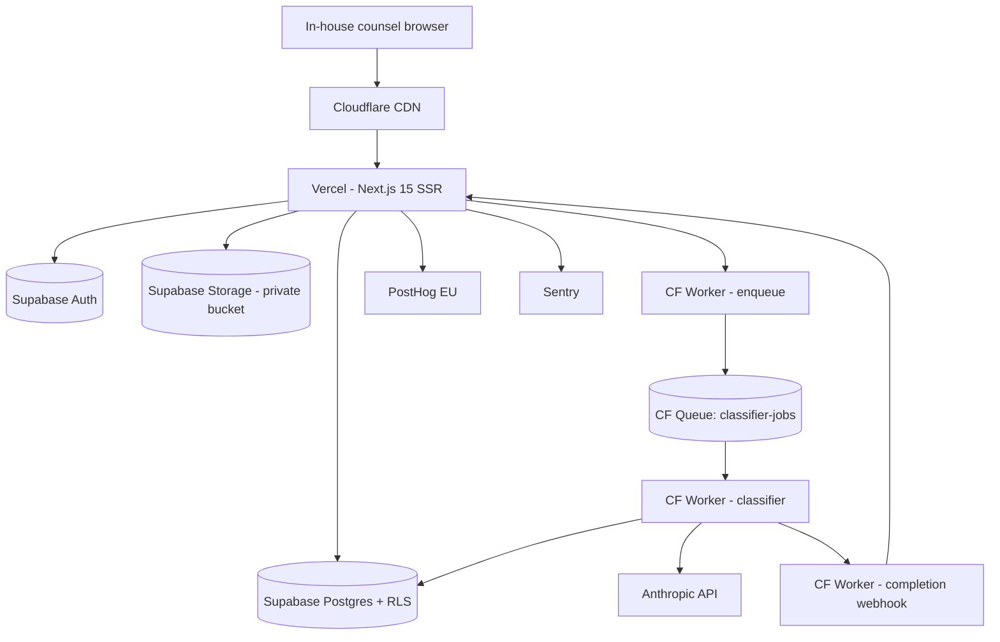

# Architecture overview

**Tech stack:** [tech-stack](../tech-stack.md) — Next.js 15 + Supabase + Cloudflare Workers
**MVP spec:** [mvp-spec](../mvp-spec.md)

## Component diagram



## Primary user flow — upload through redline

```mermaid
sequenceDiagram
  participant U as Counsel browser
  participant V as Vercel (Next.js)
  participant S as Supabase
  participant W as CF Worker (enqueue)
  participant Q as CF Queue
  participant L as CF Worker (classifier)
  participant A as Anthropic API
  U->>V: POST /api/contracts/upload (multipart, .docx)
  V->>S: storage.upload(private bucket, signed)
  S-->>V: storage_path
  V->>S: insert contract row (status='queued')
  V->>W: POST /llm/classify {contract_id}
  W->>Q: send(contract_id)
  W-->>V: 202 Accepted
  V-->>U: redirect /contracts/{id} (SSR poll)
  Q->>L: deliver(contract_id)
  L->>S: select storage_path, signed url
  L->>A: messages.create(extracted_text, clause_taxonomy)
  A-->>L: classified clauses + risk scores
  L->>S: insert findings rows; update contract status='ready'
  L->>V: POST /api/webhooks/classifier-done
  V-->>U: SSR refresh → findings visible
```

## Integration surface

| Service | Pattern | Why this pattern |
|---------|---------|-----------------|
| Supabase Postgres | sync (server) | RLS-scoped reads must block the SSR render |
| Supabase Storage | sync upload, signed-URL read | File integrity matters; signed URLs scope access |
| Cloudflare Queue | async | Classifier takes 8–40 s — must not block the request |
| Anthropic API | sync (within Worker) | Streaming responses; Worker holds the connection |
| PostHog (EU) | async (fire-and-forget) | Analytics never on the user's critical path |
| Sentry | async | Error capture must not throw further errors |

## Sync / async boundaries

| Boundary | Mode | Reason |
|----------|------|--------|
| Browser → Vercel upload | sync | User waits for upload receipt |
| Vercel → Worker enqueue | sync (HTTP 202) | Confirms job queued; cheap |
| Worker → Anthropic | sync within Worker | Streaming token UX requires holding the connection |
| Worker → Vercel webhook | async | Vercel notifies the browser via Supabase Realtime |

## Risks and unknowns

- **CF Worker 30 s CPU ceiling** vs 60+ s classifier runs on 80-page MSAs — open question, may need to chunk per-clause. Mitigation candidate: split classifier into per-section sub-jobs.
- **Anthropic rate limits at org scale** — unknown until paying customers arrive; capacity planning deferred to post-MVP.
- **Supabase Storage signed-URL expiry** must align with Worker job latency p99. Default 1 h; revisit.
- **Document parsing libraries** (docx, pdf) on Workers — Node-API gaps; PDF.js works, `mammoth` requires polyfills.

## Next ADRs implied

- ADR-002: Multi-tenant RLS model keyed on `org_id`.
- ADR-003: LLM orchestration on Cloudflare Workers (not Vercel Edge or serverless).
- ADR-004: Async classifier via CF Queue (not synchronous in-request).
