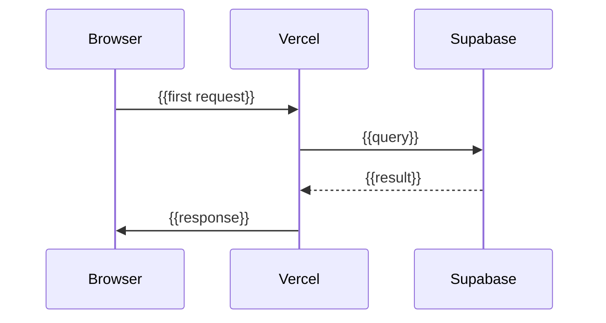

# Architecture overview

**Tech stack:** [tech-stack](../tech-stack.md)
**MVP spec:** [mvp-spec](../mvp-spec.md)

## Component diagram

```mermaid
graph TB
  Browser[Browser] --> CDN[Cloudflare CDN]
  CDN --> Vercel[Vercel - {{framework}}]
  Vercel --> Supabase[(Supabase Postgres)]
  Vercel --> Workers[Cloudflare Workers]
  Workers --> Supabase
```

## Primary user flow



## Integration surface

| Service | Pattern (sync/async/webhook) | Why this pattern |
|---------|------------------------------|-----------------|
| {{name}} | {{pattern}} | {{reason}} |

## Sync / async boundaries

| Boundary | Mode | Reason |
|----------|------|--------|
| {{A → B}} | {{sync|async}} | {{cost, latency, failure mode}} |

## Risks and unknowns

- {{component}}: {{risk}} — {{mitigation or open question}}
