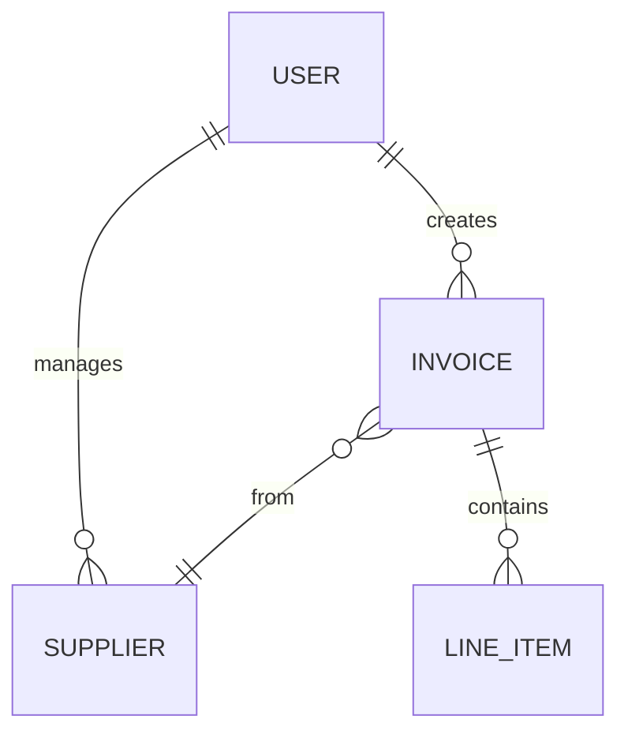

# data-model-from-vpc

Method: Jobs-to-be-done lens (Christensen et al. 2016) and Value Proposition Canvas (Osterwalder et al. 2014) — see `startups/SOURCES.md`.

Idempotency: side-effect-free planner; rewrites `09-mvp/schema/erd.mmd` and `entity-list.md` in place.

## User Context

$ARGUMENTS

## Phase 1: Read

1. Verify venture profile.
2. Read latest VPC for the segment.
3. Read segment profile (jobs / pains / gains).
4. Read `mvp-spec.md` to constrain to MVP-scope features.

## Phase 2: Identify entities

Walk the value map and segment profile:

- **People entities** — users, customers, staff, contacts. Often a
  `users` table plus a `profiles` table.
- **Domain entities** — the things the segment talks about. For a
  café accounting app, these are `invoice`, `supplier`, `account`. For
  a recipe app, `recipe`, `ingredient`, `meal_plan`.
- **Behaviour entities** — events / sessions / interactions. Often
  derived from analytics requirements.
- **Auxiliary entities** — settings, audit logs, attachments.

For each entity, list:

- Name (singular noun)
- Key attributes (3-7)
- Likely relationships to other entities
- Multiplicity (one-to-many, many-to-many)

Constrain to MVP-scope. Defer "nice to have" entities.

## Phase 3: Compose ERD

Write a Mermaid `erDiagram`:



## Phase 4: Write

Write `09-mvp/schema/erd.mmd` (just the Mermaid source) plus
`09-mvp/schema/entity-list.md` (the descriptions):

`erd.mmd`:

```mermaid
erDiagram
  ...
```

`entity-list.md`:

```markdown
---
title: Entity list
slug: entity-list
type: schema
status: draft
owner: <venture name>
created: <today>
updated: <today>
---

# Entity list

Source: [vpc-<slug>-vN](../03-value-proposition/vpc-<slug>-vN.md)

## Entities

### user
- email (unique, indexed)
- created_at
- ...

### supplier
- ...
```

## Phase 5: Cascade

Recommend `/supabase-schema-design` to turn this into the full
Postgres schema with RLS.

## Phase 6: Log

Append: `## [<today>] data-model-from-vpc | <N> entities`.

## Important principles

- **MVP scope only.** Don't model entities the MVP doesn't need.
- **ERD is source-controlled.** Mermaid file in repo, not a screenshot.
- **Singular nouns.** `user`, not `users`.
- **No connector calls.** Local-only.
