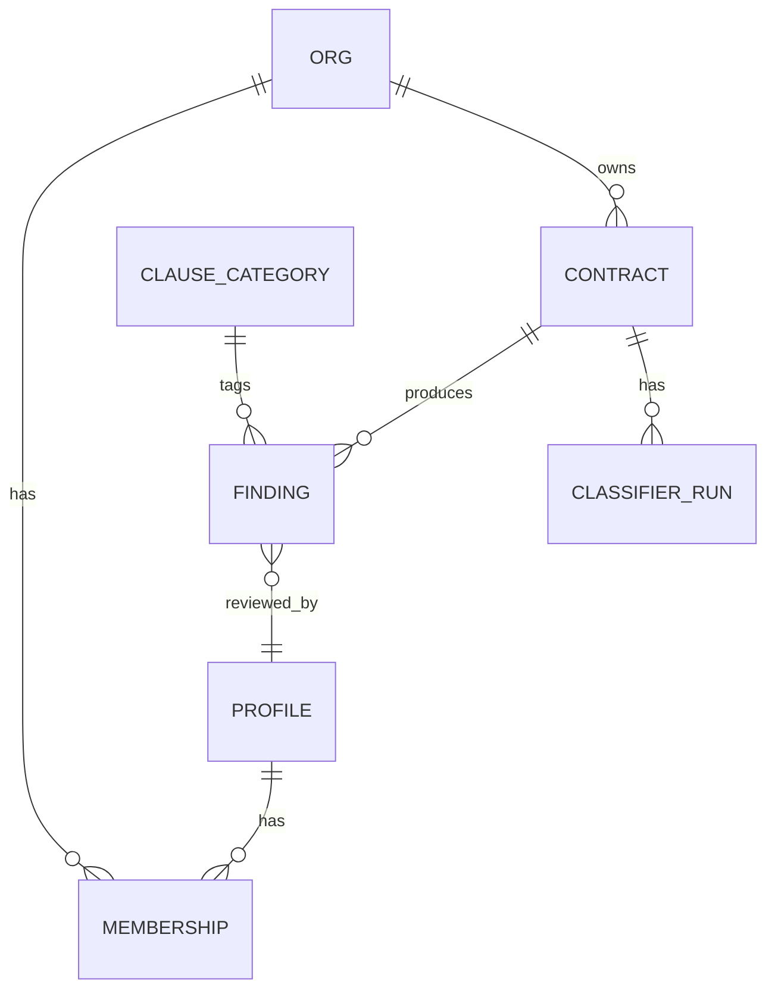

# Entity list

Source VPC: [vpc-au-mid-market-counsel-v3](../03-value-proposition/vpc-au-mid-market-counsel-v3.md)
Source segment: [AU mid-market in-house counsel](../02-customer-discovery/segments/au-mid-market-counsel/README.md)

## ERD (Mermaid — also at `erd.mmd`)

## Entities

### profile
- `id` — uuid (mirrors `auth.users.id`)
- `email` — text, unique
- `full_name` — text, nullable
- `created_at` — timestamptz
- Relationships: has many memberships; reviews many findings

### org
- `id` — uuid
- `name` — text
- `abn` — text, nullable (Australian Business Number, 11 digits)
- `plan` — text (`trial`|`starter`|`growth`)
- `created_at` — timestamptz
- Relationships: has many memberships; owns many contracts

### membership
- `org_id` — uuid (FK orgs)
- `user_id` — uuid (FK profiles)
- `role` — text (`owner`|`counsel`|`viewer`)
- `invited_at` — timestamptz
- `joined_at` — timestamptz, nullable
- Composite PK (org_id, user_id)

### contract
- `id` — uuid
- `org_id` — uuid (FK orgs, RLS key)
- `uploaded_by` — uuid (FK profiles)
- `title` — text (derived from filename or first heading)
- `file_path` — text (Supabase Storage path)
- `file_kind` — text (`docx`|`pdf`)
- `page_count` — int
- `status` — text (`queued`|`classifying`|`ready`|`failed`)
- `created_at`, `updated_at` — timestamptz
- Relationships: belongs to org; has many findings; has many classifier_runs

### classifier_run
- `id` — uuid
- `contract_id` — uuid (FK contracts)
- `model` — text (e.g. `claude-opus-4-7`)
- `started_at`, `finished_at` — timestamptz
- `status` — text (`running`|`succeeded`|`failed`)
- `error` — text, nullable
- One-to-many from contract; the latest succeeded run is the "current" findings set.

### clause_category
- `id` — text (slug, e.g. `uncapped-liability`)
- `display_name` — text
- `risk_default` — text (`high`|`medium`|`low`)
- `jurisdiction_tag` — text (`AU`|`NZ`|`generic`)
- Seeded with the 14 categories from H-003.

### finding
- `id` — uuid
- `contract_id` — uuid (FK contracts)
- `run_id` — uuid (FK classifier_runs)
- `category_id` — text (FK clause_category)
- `clause_text` — text (extracted span)
- `page_number` — int
- `risk_score` — numeric (0..1, from classifier)
- `risk_level` — text (`high`|`medium`|`low`)
- `status` — text (`pending`|`accepted`|`rejected`)
- `reviewed_by` — uuid (FK profiles), nullable
- `reviewer_comment` — text, nullable
- `reviewed_at` — timestamptz, nullable

## Out of MVP scope

| Entity | Why deferred | Trigger to add |
|--------|--------------|---------------|
| `obligation` (calendar-style deadlines) | H-001 / H-002 don't require it; adds parsing complexity | First paying customer asks; or post-H-003 success |
| `negotiation_brief` (one-page export) | Phase-2 polish | Demo feedback requests it |
| `precedent_library` (prior-accepted clauses) | Needs corpus; pre-V2 | After 100 contracts processed |
| `audit_log` | Compliance need not in MVP scope | Mid-market regulated customer (banking, insurance) |

## Hand-off

Next: `/supabase-schema-design` turns this into the full migration plan with RLS policies.
