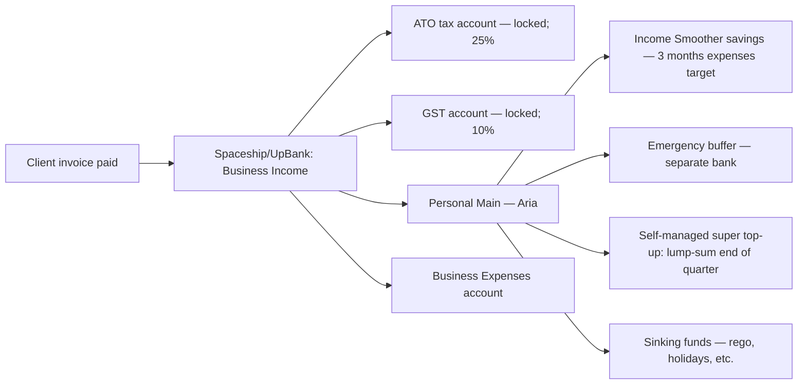

# Money Map — Aria (sole-trader graphic designer, Melbourne, irregular income)

> **Important — read first.** The information produced by this skill is **general financial information only** — not personal financial product advice as defined by the *Corporations Act 2001* (Cth). It does not take your personal objectives, circumstances, or needs into account.
>
> Before acting on anything produced here, please consult a financial adviser who is licensed by ASIC (Australian Financial Services Licence / AFSL) and an authorised representative. For tax-specific decisions, consult a registered tax agent. For Centrelink, superannuation, or estate planning, also consult a specialist as relevant.
>
> Assumptions used in projections — including investment returns, inflation, tax rates, and superannuation contribution caps — are based on publicly available information and reasonable defaults. They are illustrative, not predictive.

---

## Income Snapshot — irregular income smoothed across 3 months

| Source | Monthly invoiced (avg, AUD) | After-GST (avg) | After-tax-setaside (35%) |
|--------|----------------------------|----------------|--------------------------|
| Design clients (5–8 active, retainers + projects) | $9,400 | $8,550 | $5,560 |

- **3-month income smoothing buffer:** target ~$30k in a separate "income smoother" account to cover lean months
- **Net "available to spend" (per smoothed month):** ~$5,560

---

## Budget — Profit-First (sole-trader)

Sole-trader cash flow is **lumpy**, so the budget is profit-first: pay yourself + tax + super before expenses. The order matters.

| Bucket | % of incoming invoice | Monthly target (AUD) | Notes |
|--------|----------------------|----------------------|-------|
| Tax (PAYG instalments + EOFY top-up) | 25% | ~$2,140 | Separate ATO-only account; do NOT touch |
| GST (10% of invoiced — set aside if registered) | 10% | ~$850 | Quarterly BAS |
| Owner pay (self) | 50% of post-GST/tax | ~$2,780 | This is the "salary" Aria lives on |
| Super (voluntary, deductible) | 10% of post-GST/tax | ~$560 | Up to $30k concessional cap (incl. employer-equivalent) |
| Business expenses (software, contract artists, hardware sinking) | ~15% of post-GST/tax | ~$830 | Tracked in Xero; deductible |
| Profit (retained in biz buffer + reinvestment) | 5% of post-GST/tax | ~$280 | Builds the business's emergency runway |

---

## Bank Architecture (sole-trader)

---

## Pay-Day Routing Rules (every client invoice)

| When invoice paid | Move | From → To |
|-------------------|------|-----------|
| Within 24h of receipt | 25% of total | Income → ATO account |
| Within 24h | 10% of total | Income → GST account |
| Within 24h | 15% of total | Income → Business Expenses |
| Within 24h | Owner pay (rest) | Income → Personal Main |
| End of quarter | Lump sum | Personal Main → Super (max concessional headroom) |
| Quarterly | BAS payment | GST account → ATO |

**Critical:** the ATO + GST accounts are **untouchable**. The split happens at invoice time, not at end of quarter.

---

## Sinking Funds (annualised, drawn from Personal Main)

| Fund | Annual target (AUD) | Monthly contribution |
|------|---------------------|---------------------|
| Car rego + CTP + comprehensive | $1,400 | $115 |
| Income protection insurance | $1,800 | $150 |
| Quarterly health check + dental | $900 | $75 |
| Holiday 2027 | $4,000 | $335 |
| Hardware replacement (laptop every 4y) | $1,000 | $85 |
| Professional development (courses, conferences) | $2,400 | $200 |

---

## Quarterly Review Checklist (15 min, last Sunday of Mar/Jun/Sep/Dec)

- ☐ Reconcile invoiced vs actually-received income
- ☐ Confirm ATO + GST accounts are at expected % of YTD income
- ☐ BAS prepared and submitted (or sent to accountant)
- ☐ Super contribution made — check headroom against $30k concessional cap
- ☐ Income smoother balance — at least 3 months of personal expenses?
- ☐ Slow-paying clients flagged for follow-up
- ☐ Business expenses categorised in Xero

---

## Notes — sole-trader-specific watch-outs

- **PAYG instalments:** the ATO will start auto-sending PAYG-I notices once Aria's first tax return shows business income. The 25% setaside means the ATO bill is already in hand — never a shock.
- **GST registration:** mandatory if turnover ≥ $75k/yr (AU). Once registered, the 10% setaside is non-negotiable.
- **PSI rules:** if > 80% of income is from a single client, ATO may apply Personal Services Income rules — restricts deductions. Have an accountant review annually.
- **Income protection > life insurance** for a sole-trader without dependants — your ability to work is the asset.
- **Super contribution timing:** the lump-sum approach (end of quarter) lets Aria see real income before committing to super. End-of-quarter, not pay-by-pay.
