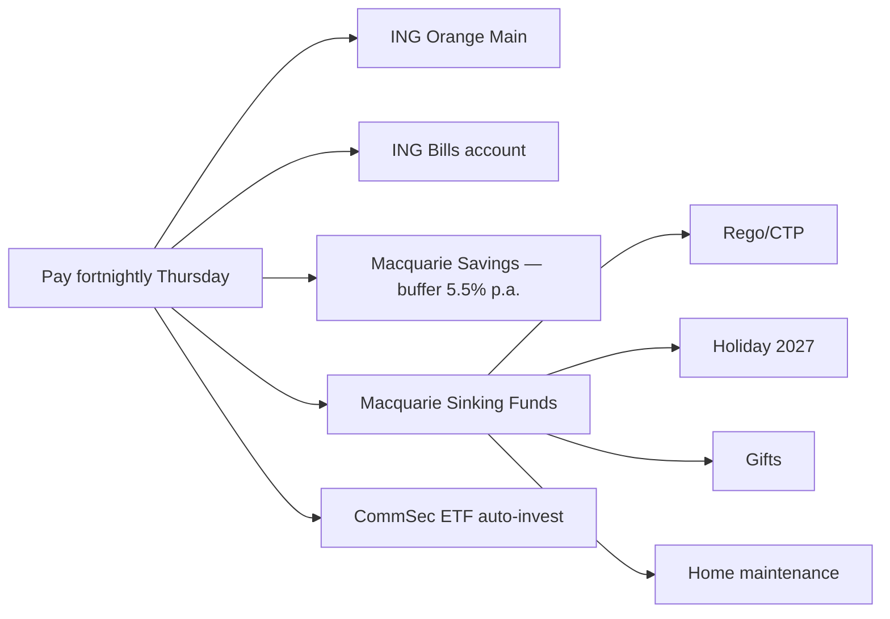

# Money Map — Olivia & Jordan (Sydney, dual income, 2 kids)

> **Important — read first.** The information produced by this skill is **general financial information only** — not personal financial product advice as defined by the *Corporations Act 2001* (Cth). It does not take your personal objectives, circumstances, or needs into account.
>
> Before acting on anything produced here, please consult a financial adviser who is licensed by ASIC (Australian Financial Services Licence / AFSL) and an authorised representative. For tax-specific decisions, consult a registered tax agent. For Centrelink, superannuation, or estate planning, also consult a specialist as relevant.
>
> Assumptions used in projections — including investment returns, inflation, tax rates, and superannuation contribution caps — are based on publicly available information and reasonable defaults. They are illustrative, not predictive.

---

## Income Snapshot

| Source | Gross/fortnight (AUD) | Net/fortnight (AUD) |
|--------|----------------------|--------------------|
| Olivia — PAYG | 4,615 | 3,310 |
| Jordan — PAYG | 3,461 | 2,640 |

Total net per fortnight: **$5,950**
Total net per year: **$154,700**

---

## Budget — 50/30/20 (modified)

| Category | Target % | Target AUD/fortnight | Actual | Notes |
|----------|---------|---------------------|--------|-------|
| Mortgage | 32% | 1,905 | 1,905 | P&I on PPOR |
| Utilities + comms | 4% | 240 | 245 | Slightly over |
| Groceries | 9% | 540 | 580 | Family of 4 |
| Transport + fuel | 4% | 240 | 260 | One car, one PT pass |
| Insurance (home + car + life + income) | 4% | 240 | 240 | |
| Childcare (subsidised) | 6% | 360 | 360 | One in care 3 days |
| Subscriptions | 1% | 60 | 80 | Streaming bloat — audit due |
| Discretionary | 12% | 715 | 760 | Slightly over — review |
| Buffer | 3% | 180 | 180 | |
| Sinking funds | 6% | 360 | 360 | See below |
| Investment / super top-up | 13% | 770 | 770 | Salary sacrifice + ETF top-up |
| Debt extra | 6% | 380 | 380 | Mortgage offset |

Total: 100% / $5,950

---

## Bank Architecture

---

## Pay-Day Routing Rules (Thursday)

| On pay-day | Move | From → To |
|-----------|------|-----------|
| Day 1 | $2,385 | Main → Bills account (covers mortgage + utilities + childcare + insurance) |
| Day 1 | $180 | Main → Buffer |
| Day 1 | $360 | Main → Sinking funds bundle |
| Day 1 | $770 | Main → Investment / super top-up |
| Day 1 | $380 | Main → Mortgage offset |

Set as automatic transfers Thursday 09:00 via ING + Macquarie app.

---

## Sinking Funds

| Fund | Target ($) | Target date | Monthly contribution |
|------|-----------|------------|---------------------|
| Rego + CTP — Olivia's car | 850 | 15/03/2027 | $80 |
| Car insurance renewal | 1,400 | 01/06/2027 | $115 |
| Car service | 600 | every 6 mo | $100 |
| Home rates | 2,800 | quarterly | $235 |
| Home maintenance | 2,400 | annual rolling | $200 |
| Holiday 2027 — South Coast | 4,500 | 20/01/2027 | $375 |
| Birthdays + Christmas | 2,400 | annual rolling | $200 |
| Professional development (Jordan's course) | 3,000 | 01/07/2027 | $215 |

---

## Monthly Review Checklist (Sunday before pay-day, 15 min)

- ☐ Reconcile actuals vs budget per category
- ☐ Move any spending-account surplus into mortgage offset
- ☐ Flag "leakage" categories (subscriptions, discretionary — both over this month)
- ☐ Adjust sinking-fund contributions if target dates moved
- ☐ Note one win + one slip in shared note
