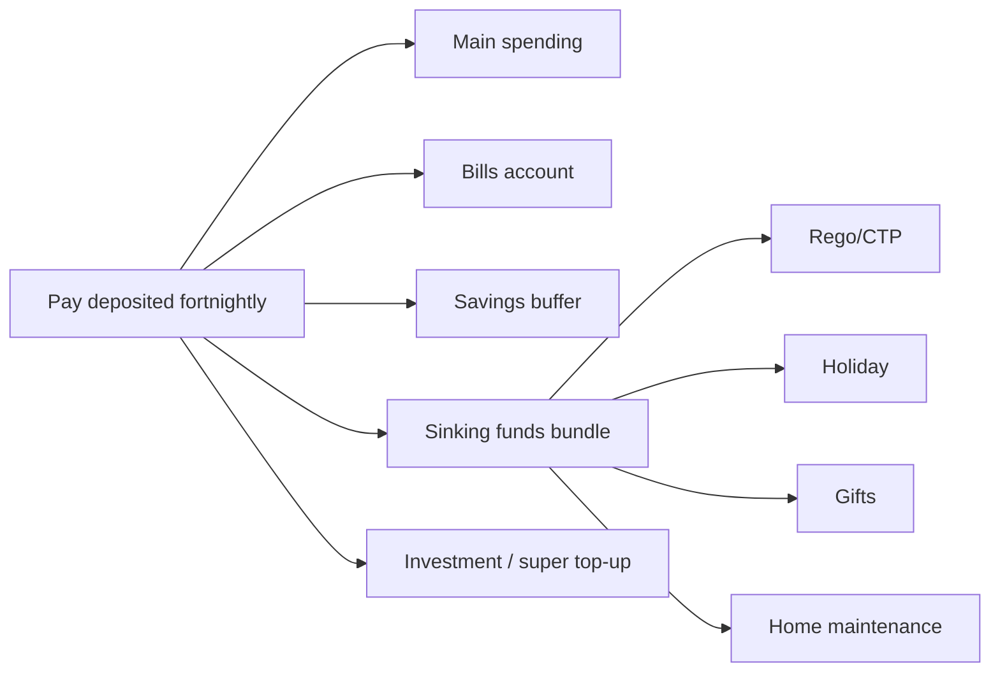

# Money Map — {{user_name_or_alias}}

> **Important — read first.** The information produced by this skill is **general financial information only** — not personal financial product advice as defined by the *Corporations Act 2001* (Cth). It does not take your personal objectives, circumstances, or needs into account.
>
> Before acting on anything produced here, please consult a financial adviser who is licensed by ASIC (Australian Financial Services Licence / AFSL) and an authorised representative. For tax-specific decisions, consult a registered tax agent. For Centrelink, superannuation, or estate planning, also consult a specialist as relevant.
>
> Assumptions used in projections — including investment returns, inflation, tax rates, and superannuation contribution caps — are based on publicly available information and reasonable defaults. They are illustrative, not predictive.

---

## Income Snapshot

| Source | Gross/fortnight (AUD) | Net/fortnight (AUD) |
|--------|----------------------|--------------------|
| {{source}} | {{gross}} | {{net}} |

Total net per fortnight: **${{net_total}}**
Total net per year: **${{net_year}}**

---

## Budget — {{framework}}

| Category | Target % | Target AUD/fortnight | Actual | Notes |
|----------|---------|---------------------|--------|-------|
| Rent / mortgage | | | | |
| Utilities | | | | |
| Groceries | | | | |
| Transport | | | | |
| Insurance | | | | |
| Subscriptions | | | | |
| Discretionary | | | | |
| Buffer | | | | |
| Sinking funds | | | | |
| Investment / super top-up | | | | |
| Debt extra | | | | |

Total: 100% / ${{net_total}}

---

## Bank Architecture

---

## Pay-Day Routing Rules

| On pay-day | Move | From → To |
|-----------|------|-----------|
| Day 1 | ${{x}} | Main → Bills |
| Day 1 | ${{x}} | Main → Buffer |
| Day 1 | ${{x}} | Main → Sinking funds bundle |
| Day 1 | ${{x}} | Main → Investment / super |

Set as automatic transfers in your banking app on pay-day morning.

---

## Sinking Funds

| Fund | Target ($) | Target date | Monthly contribution |
|------|-----------|------------|---------------------|
| Rego + CTP | | | |
| Car insurance | | | |
| Car service | | | |
| Tyre replacement | | | |
| Home rates | | | |
| Home maintenance | | | |
| Holidays | | | |
| Birthdays + Christmas | | | |
| Education / professional development | | | |

---

## Monthly Review Checklist (15 min)

- ☐ Reconcile actuals vs budget per category
- ☐ Re-route any surplus
- ☐ Flag "leakage" categories (over by > 10%)
- ☐ Adjust sinking-fund contributions if target dates moved
- ☐ Note one win + one slip
