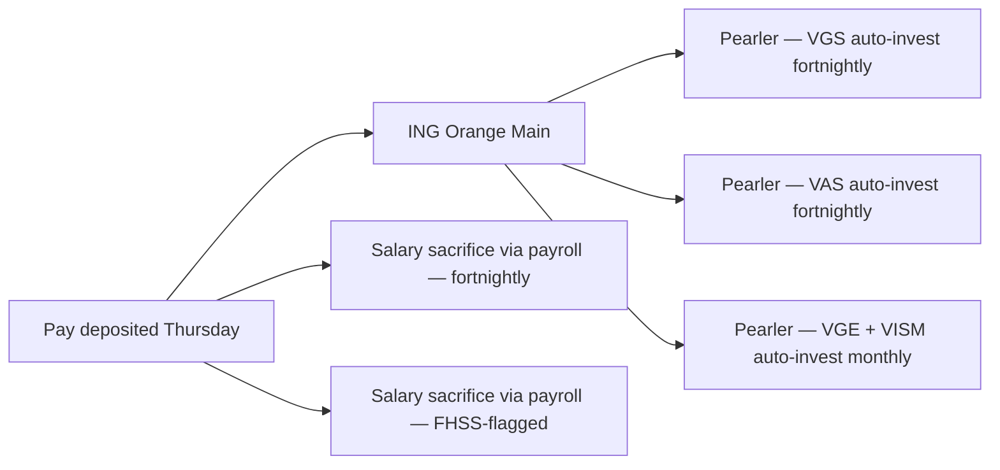

# Savings Game Plan — Daniel (Sydney, 32, software engineer, FIRE-leaning)

> **Important — read first.** The information produced by this skill is **general financial information only** — not personal financial product advice as defined by the *Corporations Act 2001* (Cth). It does not take your personal objectives, circumstances, or needs into account.
>
> Before acting on anything produced here, please consult a financial adviser who is licensed by ASIC (Australian Financial Services Licence / AFSL) and an authorised representative. For tax-specific decisions, consult a registered tax agent. For Centrelink, superannuation, or estate planning, also consult a specialist as relevant.
>
> Assumptions used in projections — including investment returns, inflation, tax rates, and superannuation contribution caps — are based on publicly available information and reasonable defaults. They are illustrative, not predictive.

---

## Target Snapshot

| Metric | Value |
|--------|-------|
| Net income (annual, after super) | $158,000 |
| Current savings rate | 24% |
| Target savings rate | **55%** (FIRE-leaning) |
| Target $/fortnight saved | $3,340 |
| Target $/year saved | $86,900 |
| FIRE target net worth | $1.5M (4% rule × $60k/yr "lean FIRE" lifestyle) |
| Years to FIRE target (base scenario) | ~13 years (age 45) |

---

## Allocation Across Buckets

| Bucket | % of savings | $/fortnight | Goal |
|--------|-------------|-------------|------|
| Emergency buffer (one-time fill) | 0% (already at 6 mo) | $0 | Maintained at $40k |
| Super concessional cap utilisation | 17% | $570 | Salary sacrifice up to $30k/yr concessional cap |
| Outside-super ETF — global (VGS / IVV) | 42% | $1,400 | Long-term wealth core |
| Outside-super ETF — AU (VAS / A200) | 18% | $600 | Franking credits; home bias hedge |
| Outside-super ETF — emerging markets / small-cap (VGE / VISM) | 8% | $270 | Diversification tilt |
| FHSS contribution | 15% | $500 | Mid-term: first home in 4–5 yrs ($50k max) |

**Outside-super heavy because:** Daniel wants to retire before preservation age (60). Super alone is inaccessible for a 13-year horizon — bridge years 45–60 must be funded outside super.

---

## Automation Flow

- **Pay-day rule (Thursday):** $1,400 → Pearler VGS; $600 → VAS; $270 → emerging-markets (monthly batched); $500 → FHSS-flagged super contribution
- **Monthly auto-invest:** 15th — Pearler executes batched buy orders
- **Salary sacrifice (payroll):** $14,820/yr → super (gets close to but does not exceed $30k concessional cap; combined with $11.4k employer SG = $26.2k)

---

## 12-Month Milestones

| Month | Milestone |
|-------|-----------|
| 1 | Pearler accounts opened (VGS / VAS / VGE / VISM); auto-invest configured; FHSS opt-in lodged with super fund |
| 3 | First $15k invested across 4 ETFs; confirm holdings + bid-ask discipline |
| 6 | FY-end (June) — first FHSS contribution year complete ($15k); verify with super fund |
| 9 | Annual rebalance check — 60/25/15 target weights |
| 12 | Net-worth review; verify on track for ~13-yr horizon; bump rate if income grew |

---

## FIRE-Specific Calculations

| Phase | Plan |
|-------|------|
| **Accumulation (years 1–13)** | Save $87k/yr into super + outside-super at ~70/30 outside/super weighting |
| **Bridge years (age 45–60)** | Live off outside-super ETF drawdown; preserve super untouched |
| **Pension phase (age 60+)** | Switch to retirement-phase pension within super; tax-free withdrawals |

**Sequence-of-returns risk in bridge years:** Daniel needs 15 years of outside-super expenses ($60k × 15 = $900k real). Target outside-super balance at age 45: **$900k+**. Super doesn't need to grow further after that — passive growth + employer SG carries it to age 60.

---

## Review Cadence

- **Quarterly:** 30-min review on the 3rd Sunday of Mar / Jun / Sep / Dec — confirm contribution rates, check rebalancing band (±5% of target weight), review tax-loss harvesting opportunities
- **Annual (end of FY 30/06):** Full rebalance; reconcile FHSS YTD; check concessional headroom; consider non-concessional contribution if cash surplus exceeds 12 months bridge expenses

---

## Suggested questions for a licensed adviser

- Is my 70% outside-super / 30% in-super allocation optimal for a 13-year bridge? (Could be too defensive if I'm willing to delay retirement by 1–2 years to lift super weighting.)
- Am I tax-optimal given my income? Should I consider a self-managed super fund at $1M+ super balance?
- Is FHSS still worth it if I'm not 100% sure I'll buy a home? (Withdrawal mechanics and reversal costs.)
- Should I salary-sacrifice the full $30k cap or carry forward unused cap from prior years (now possible under carry-forward rules)?
- For the bridge-year ETF drawdown, what's the recommended cash buffer to mitigate sequence-of-returns risk?

---

## FIRE-Specific Watch-Outs

- **Lifestyle inflation is the killer.** A 55% savings rate at $158k net = $86k/yr saved. At $200k net + lifestyle inflation, the same 55% target requires $110k/yr saved — but if lifestyle quietly grew to $90k/yr expenses, FIRE target moves from $1.5M to $2.25M and adds 4+ years.
- **The 4% rule is historical, not predictive.** AU market is more volatile than US (the Trinity Study's source). Plan for a conservative 3.5% withdrawal rate or build in flexibility (Guyton-Klinger rules).
- **Health insurance pre-Medicare-age.** From age 45 (FIRE date) to age 65 (Medicare access age elsewhere), you're in AU's Medicare system — coverage continues, but private health adds optional cost.
- **One Big Beautiful Trap:** quitting work at 45 then realising you're bored is common. Build a post-FIRE "what I'd actually do" plan well before the date.
