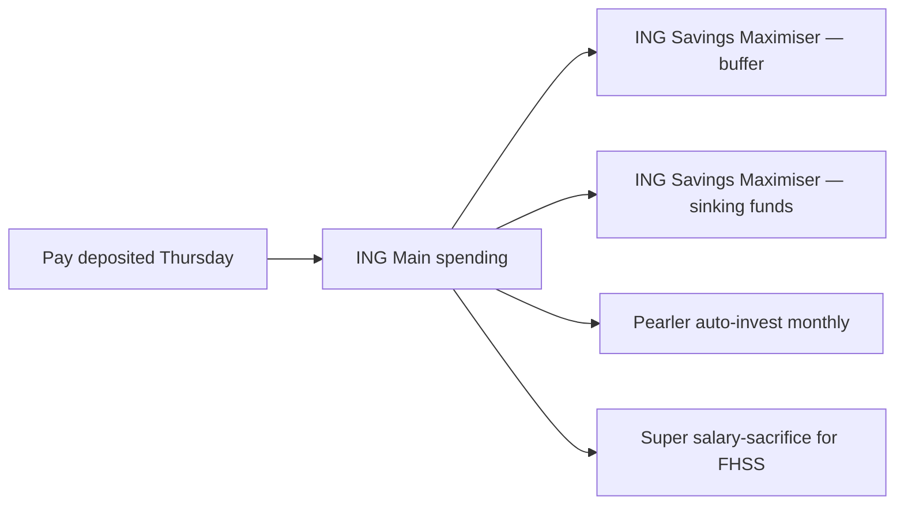

# Savings Game Plan — Mia (Melbourne, 29, marketing manager, saving for house deposit)

> **Important — read first.** The information produced by this skill is **general financial information only** — not personal financial product advice as defined by the *Corporations Act 2001* (Cth). It does not take your personal objectives, circumstances, or needs into account.
>
> Before acting on anything produced here, please consult a financial adviser who is licensed by ASIC (Australian Financial Services Licence / AFSL) and an authorised representative. For tax-specific decisions, consult a registered tax agent. For Centrelink, superannuation, or estate planning, also consult a specialist as relevant.
>
> Assumptions used in projections — including investment returns, inflation, tax rates, and superannuation contribution caps — are based on publicly available information and reasonable defaults. They are illustrative, not predictive.

---

## Target Snapshot

| Metric | Value |
|--------|-------|
| Net income (annual) | $86,200 |
| Current savings rate | 12% |
| Target savings rate | 25% |
| Target $/fortnight saved | $830 |
| Target $/year saved | $21,550 |

---

## Allocation Across Buckets

| Bucket | % of savings | $/fortnight | Goal |
|--------|-------------|-------------|------|
| Emergency buffer | 10% | $83 | 4 months expenses ($14,000) |
| Sinking funds | 10% | $83 | Annual smoothing |
| House deposit (FHSS-eligible) | 60% | $498 | $80k by Aug 2029 (using FHSS up to $15k/yr / $50k total) |
| Investment (ETF — diversified) | 10% | $83 | Long-term outside super |
| Super salary-sacrifice | 10% | $83 | Boost long-term + tax-effective |

---

## Automation Flow

- **Pay-day Thursday:** $83 → Buffer; $83 → Sinking funds; $83 → ETF; $498 stays in Main routed to FHSS-eligible super top-up via payroll
- **Monthly auto-invest:** 15th of month, $200 into VGS + $200 into A200 via Pearler
- **Salary sacrifice (payroll):** $13,000/yr → super (concessional-cap-aware; well below current $30k)

---

## 12-Month Milestones

| Month | Milestone |
|-------|-----------|
| 1 | Buffer at $3,000 |
| 3 | Buffer at $5,500 + sinking funds funded |
| 6 | Buffer at $11,000 (close to 3 months) |
| 9 | FHSS super balance ~$10k |
| 12 | FHSS at $14k (year 1 of 4); year-end review; check income → bump rate +2% if 2027 salary raises |

---

## Review Cadence

- **Quarterly:** 30-min review on the 3rd Sunday of Mar / Jun / Sep / Dec
- **Annual (end of FY 30/06):** Full review — confirm FHSS contributions, super cap headroom, ETF growth, consider rebalance

---

## Suggested questions for a licensed adviser

- Should I use FHSS at maximum $15k/yr or split between FHSS and outside-super investment?
- At my marginal rate (32.5% + Medicare), is the FHSS benefit ~$3k/yr worth the contribution-cap usage?
- When I'm ready to buy, what's the FHSS release process and timing?
- Is my outside-super ETF mix (50% VGS / 50% A200) right for a 4-year horizon?
