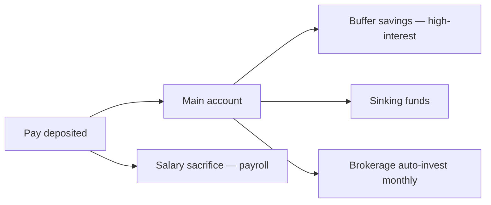

# Savings Game Plan — {{user_name_or_alias}}

> **Important — read first.** The information produced by this skill is **general financial information only** — not personal financial product advice as defined by the *Corporations Act 2001* (Cth). It does not take your personal objectives, circumstances, or needs into account.
>
> Before acting on anything produced here, please consult a financial adviser who is licensed by ASIC (Australian Financial Services Licence / AFSL) and an authorised representative. For tax-specific decisions, consult a registered tax agent. For Centrelink, superannuation, or estate planning, also consult a specialist as relevant.
>
> Assumptions used in projections — including investment returns, inflation, tax rates, and superannuation contribution caps — are based on publicly available information and reasonable defaults. They are illustrative, not predictive.

---

## Target Snapshot

| Metric | Value |
|--------|-------|
| Net income (annual) | ${{net_year}} |
| Current savings rate | {{n}}% |
| Target savings rate | {{n}}% |
| Target $/fortnight saved | ${{n}} |
| Target $/year saved | ${{n}} |

---

## Allocation Across Buckets

| Bucket | % of savings | $/fortnight | Goal |
|--------|-------------|-------------|------|
| Emergency buffer | {{n}}% | ${{n}} | {{x_months}} months expenses |
| Sinking funds | {{n}}% | ${{n}} | Smooth annual costs |
| Goal-specific | {{n}}% | ${{n}} | {{goal_name}} |
| Investment (ETF) | {{n}}% | ${{n}} | Long-term wealth |
| Super top-up | {{n}}% | ${{n}} | Below ATO concessional cap |

---

## Automation Flow

- **Pay-day rule:** $X → Buffer; $Y → Sinking funds; $Z → Brokerage
- **Monthly auto-invest:** On the 15th of each month, auto-buy ${{n}} ETF
- **Salary sacrifice:** ${{n}}/yr via payroll → super

---

## 12-Month Milestones

| Month | Milestone |
|-------|-----------|
| 1 | Buffer at ${{n}} |
| 3 | Sinking funds + buffer funded |
| 6 | Buffer at {{n}} months expenses |
| 9 | Investment cadence stable |
| 12 | Year-end review; bump rate +2% if income grew |

---

## Review Cadence

- **Quarterly:** 30-min review; reconcile vs plan; adjust contributions
- **Annual (end of FY):** Full review; check super cap usage; consider FHSS top-up if eligible

---

## Suggested questions for a licensed adviser

- Am I optimally split between super and outside-super investment for my marginal tax rate?
- Should I top up super to the concessional cap this FY?
- For my deposit goal, does FHSS make sense given timing?
