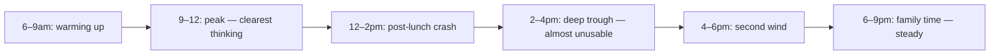

# Energy Map — Liam (Perth, fly-in-fly-out engineer)

**Log period:** 06/05 – 12/05/2026
**Days logged:** 7
**Prepared by:** Energy Detective skill

---

## Energy Heatmap

Scale: 1 (depleted) – 5 (peak). `—` = not logged.

| Day | 6am | 7 | 8 | 9 | 10 | 11 | 12 | 1pm | 2 | 3 | 4 | 5 | 6 | 7 | 8 | 9 | 10pm |
|-----|-----|---|---|---|----|----|----|-----|---|---|---|---|---|---|---|---|------|
| Mon | — | 2 | 3 | 4 | 4 | 4 | 3 | 2 | 2 | 2 | 2 | 3 | 3 | 3 | 2 | 2 | 2 |
| Tue | — | 2 | 3 | 4 | 5 | 4 | 4 | 3 | 2 | 2 | 3 | 3 | 3 | 3 | 2 | 2 | — |
| Wed | — | 2 | 3 | 5 | 5 | 4 | 3 | 2 | 1 | 2 | 3 | 4 | 4 | 3 | 3 | 2 | 2 |
| Thu | — | 2 | 3 | 4 | 4 | 4 | 3 | 2 | 2 | 3 | 4 | 4 | 4 | 3 | 3 | 2 | — |
| Fri | — | 3 | 3 | 3 | 3 | 3 | 2 | 2 | 1 | 2 | 2 | 3 | 4 | 4 | 4 | 3 | 3 |
| Sat | 4 | 4 | 4 | 5 | 4 | 4 | 3 | 4 | 4 | 4 | 4 | 4 | 4 | 3 | 3 | 3 | 2 |
| Sun | 4 | 4 | 4 | 4 | 4 | 3 | 3 | 2 | 2 | 3 | 3 | 3 | 3 | 3 | 3 | 2 | 2 |

---

## Dominant Pattern

---

## Top 3 Drains

| # | Drain | Frequency | Evidence |
|---|-------|-----------|----------|
| 1 | Post-lunch desk work (12:30–2:30pm) | 5× | "Heavy lunch + back at desk = nothing useful" — Mon, Tue, Wed, Thu, Sun |
| 2 | Friday afternoon site-status calls | 1× (recurring weekly) | "Friday 2pm call — last energy of the week gone" — Fri logged as 1 |
| 3 | Late screen time (9–10:30pm) | 4× | Energy drops 1 point in the bin *after* late screens — Mon, Tue, Wed, Sat |

---

## Top 3 Restores

| # | Restore | Frequency | Evidence |
|---|---------|-----------|----------|
| 1 | Mid-morning walk to coffee (10–10:30) | 4× | Energy rises 0.5–1 in the bin after — Mon, Tue, Wed, Thu |
| 2 | Saturday morning routine (no alarm + breakfast outside) | 1× (weekly) | Highest single-day average all week — Sat |
| 3 | Late-afternoon walk before dinner (5pm) | 3× | 4pm trough → 4 by 5pm — Wed, Thu, Sun |

---

## Chronotype & Cycle Map

- **Chronotype:** Hummingbird — peak mid-morning
- **Peak window:** 9:00–11:30
- **Afternoon dip:** 1:30–3:30pm (sharper than typical — likely meal-driven)
- **Ultradian rhythm:** ~90-min cycles; trough markers — yawning, second coffee craving, opening 5 browser tabs in quick succession

---

## One-Week Schedule Recommendation

| Slot | Energy state | Use for |
|------|-------------|---------|
| 9:00–11:30 | Peak | Deep work — protect via [[deep-focus-day]] |
| 11:30–12:30 | Steady | One-on-ones, design reviews |
| 12:30–2:30 | Trough | Lunch *away from desk*; walk; admin; **no deep work, no calls** |
| 4:00–6:00 | Second wind | Code reviews, writing, light deep work |
| 6:00–9:00 | Steady (family) | Family time — protect; no work emails |

**Drains to remove/move next week:**

- Move the Friday site-status call to Thursday 10am (peak hour, before the FIFO flight)
- Lunch *outside the office*, never at the desk. Even a 15-min walk break is enough.

---

## 2 Hypotheses to Test (next 2 weeks)

1. **If I lunch away from desk for 30+ min, Mon–Thu 12:30–2:30 average will rise from 2.2 to ≥3.0.** Success metric: average of those bins across 8 working days.
2. **If I move the Friday status call to Thursday 10am, Friday afternoon energy will rise from 1.5 to ≥3.0.** Success metric: Friday 2–4pm bins.

---

## 5-Day Re-Log Template

Log only the changed bins to validate.

| Day | Bin to log | Time | Energy (1–5) | Focus (1–5) | Notes |
|-----|-----------|------|-------------|-------------|-------|
| 1 | Lunch + post-lunch | 12:30, 2:00 | | | Lunch location + walk Y/N |
| 2 | Lunch + post-lunch | 12:30, 2:00 | | | |
| 3 | Lunch + post-lunch | 12:30, 2:00 | | | |
| 4 | Friday status call moved | Thu 10am | | | New call slot |
| 5 | Friday afternoon | 2pm, 4pm | | | Should now be free for deep work or rest |
