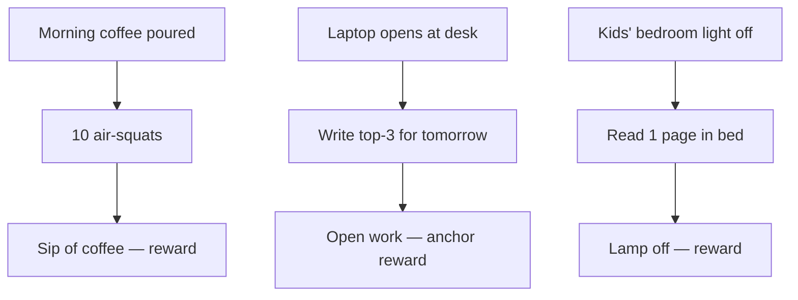

# Habit Stack — Priya (Melbourne, software engineer, two kids)

**Date:** 15/05/2026
**Identity:** A calm, strong, present parent who reads daily.
**Stack length:** 3 habits
**Prepared by:** Habit Stacker skill

---

## Identity Statement

> I'm becoming the kind of person who is strong in body, calm in mind, and present with my kids. I don't need motivation — I have a stack. I don't need willpower — I have an environment that does the work. One miss is normal. Two misses, I redesign.

---

## The Stack

1. **After I pour my morning coffee, I will do 10 air-squats next to the kettle.**
   - Cue: kettle click + coffee aroma
   - Reward: sip of coffee + tick on the fridge tracker
   - Minimum-viable version: 5 squats (B-day version)
2. **After I sit down at my desk and open my laptop, I will write tomorrow's top-3 in a paper notebook.**
   - Cue: laptop wake screen
   - Reward: pen click + first task in a fresh notebook line
   - Minimum-viable version: write the *first* task only
3. **After the kids' bedtime story, I will read one page of my current book in bed.**
   - Cue: kids' bedroom light switching off
   - Reward: bookmark advanced + lamp off
   - Minimum-viable version: open the book and read one sentence

---

## Stack Flow

---

## Friction Design

| Habit | Remove from environment | Add to environment |
|-------|------------------------|--------------------|
| 10 squats | Phone out of kitchen during coffee | Kettle moved next to clear floor space |
| Top-3 notebook | Slack auto-launching on laptop open | Paper notebook + pen on closed laptop |
| One page reading | Phone charging in kitchen, not bedroom | Book on pillow before kids' bath |

---

## Tracker Spec

- **Format:** A4 paper grid pinned to the fridge — 3 rows × 56 days (8 weeks). One coloured X per completed habit.
- **Streak rule:** Never miss twice. One miss is recovery; two in a row triggers a 15-min redesign.
- **Review cadence:**
  - End-of-day glance: 30 seconds (when filling fridge tracker)
  - End-of-week review: 5 minutes every Sunday evening
  - End-of-month redesign: 15 minutes on the last day of each month

---

## 8-Week Ramp

| Week | Focus | Intensity | Notes |
|------|-------|-----------|-------|
| 1–2 | Squats only | 10 squats, minimum-viable on notebook + reading | Build the keystone before layering |
| 3–4 | Add notebook | 15 squats / full top-3 / 1 page | Notebook starts properly week 3 |
| 5–6 | Add reading | 20 squats / full top-3 / 3 pages | Reading starts properly week 5 |
| 7–8 | Full intensity | 25 squats / full top-3 / 5 pages | First monthly review end of week 8 |

---

## Failure Modes & Recovery

| Failure mode | Likelihood | Symptom | Recovery move |
|--------------|-----------|---------|---------------|
| Sick kid → broken week | High | Skipped 3+ days | Restart at week-1 intensity; do B-day version for 3 days, then resume |
| Work deadline → no top-3 | High | Notebook empty Mon–Thu | Write the *single* top task; nothing else. Resume Friday. |
| Travel for work | Medium | Stack location absent | Portable keystone only: 10 squats in hotel; skip notebook + reading guilt-free |
| Friday wine + late TV | Medium | Reading skipped two nights running | Set bedroom alarm for "lights out + book on pillow" at 9:45pm Friday |
| Perfectionism spiral after a missed day | Medium | "I've broken the streak" | Read the never-miss-twice rule aloud. Do the minimum-viable today. Do not bargain. |

---

## First-Week Checklist

| Day | Trigger | Done? |
|-----|---------|-------|
| Mon 19/05 | Coffee → 10 squats | ☐ |
| Tue 20/05 | Coffee → 10 squats | ☐ |
| Wed 21/05 | Coffee → 10 squats | ☐ |
| Thu 22/05 | Coffee → 10 squats | ☐ |
| Fri 23/05 | Coffee → 10 squats | ☐ |
| Sat 24/05 | Coffee → 10 squats (B-day: 5 OK) | ☐ |
| Sun 25/05 | Coffee → 10 squats + End-of-week review (5 min) | ☐ |

---

## Next Steps

1. Print this page and pin it to the fridge tonight.
2. Move the kettle and clear a 1m² floor space tomorrow morning before family wakes.
3. Buy the A4 grid notebook + a paper journal at the local newsagent on Saturday.
